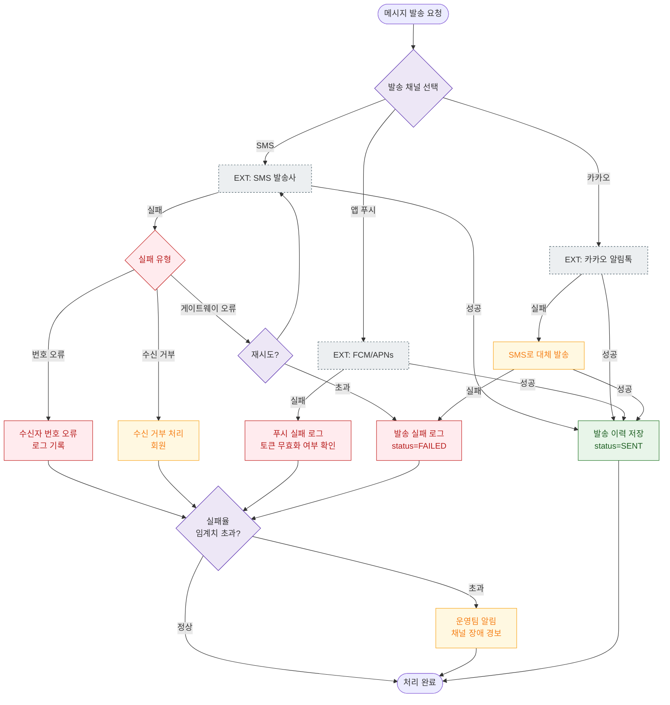

# E15 — 메시지 발송 실패

## 1. 개요

| 항목 | 내용 |
|------|------|
| 에러코드 | E503002 (외부 채널 오류) |
| HTTP | 503 Service Unavailable |
| 발생 모듈 | 마케팅 (SMS/카카오/앱 푸시) |
| 영향 화면 | SCR-071 메시지 발송, SCR-072 자동 알림 설정 |

## 2. 발생 조건

- SMS 발송사 API 오류
- 카카오 알림톡 채널 장애
- 앱 푸시 서버(FCM/APNs) 응답 실패
- 수신자 번호 오류/수신 거부

## 3. 다이어그램

## 4. 복구/재시도 전략

| 상황 | 전략 |
|------|------|
| 게이트웨이 오류 | 최대 3회 자동 재시도 |
| 카카오 장애 | SMS 자동 대체 발송 |
| 수신 거부 | 처리, 이후 발송 차단 |
| 번호 오류 | 실패 로그, 관리자 번호 수정 유도 |
| 실패율 임계치 초과 | 운영팀 알림, 채널 점검 |

## 5. 사용자 노출 메시지

| 대상 | 메시지 |
|------|--------|
| 관리자 화면 | 발송 실패 건수 배지 표시 (SCR-071) |
| 운영팀 알림 | "[FitGenie ALERT] 메시지 발송 실패율 {N}% 초과. 채널 점검 필요." |
