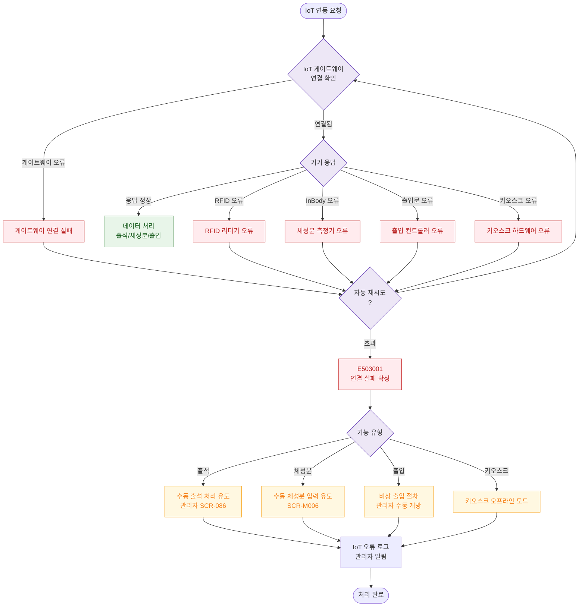

# E16 — IoT 연결 실패

## 1. 개요

| 항목 | 내용 |
|------|------|
| 에러코드 | E503001 (IoT/단말기) |
| HTTP | 503 Service Unavailable |
| 발생 모듈 | 시설/IoT |
| 영향 화면 | SCR-083 IoT/출입 관리, SCR-I003 IoT 연동, SCR-I001 통합 출석 |

## 2. 발생 조건

- IoT 게이트웨이 통신 오류
- RFID/밴드 리더기 연결 끊김
- 체성분 측정기(InBody) 연동 실패
- 키오스크 하드웨어 오류
- 출입문 컨트롤러 통신 실패

## 3. 다이어그램

## 4. 복구/재시도 전략

| 상황 | 전략 |
|------|------|
| 자동 재시도 3회 실패 | 수동 대체 절차 안내 |
| 출석 IoT 실패 | 관리자 수동 출석 처리 |
| 체성분 IoT 실패 | 수동 입력 폼 유도 |
| 출입문 실패 | 비상 절차, 관리자 수동 개방 |
| 키오스크 실패 | 오프라인 모드 전환 |

## 5. 사용자 노출 메시지

| 에러코드 | 메시지 |
|----------|--------|
| E503001 (출석) | "출석 단말기에 연결할 수 없습니다. 관리자에게 문의해주세요." |
| E503001 (체성분) | "체성분 측정기 연결에 실패했습니다. 수동으로 입력해주세요." |
| E503001 (출입) | "출입 시스템 오류가 발생했습니다. 관리자를 호출해주세요." |
