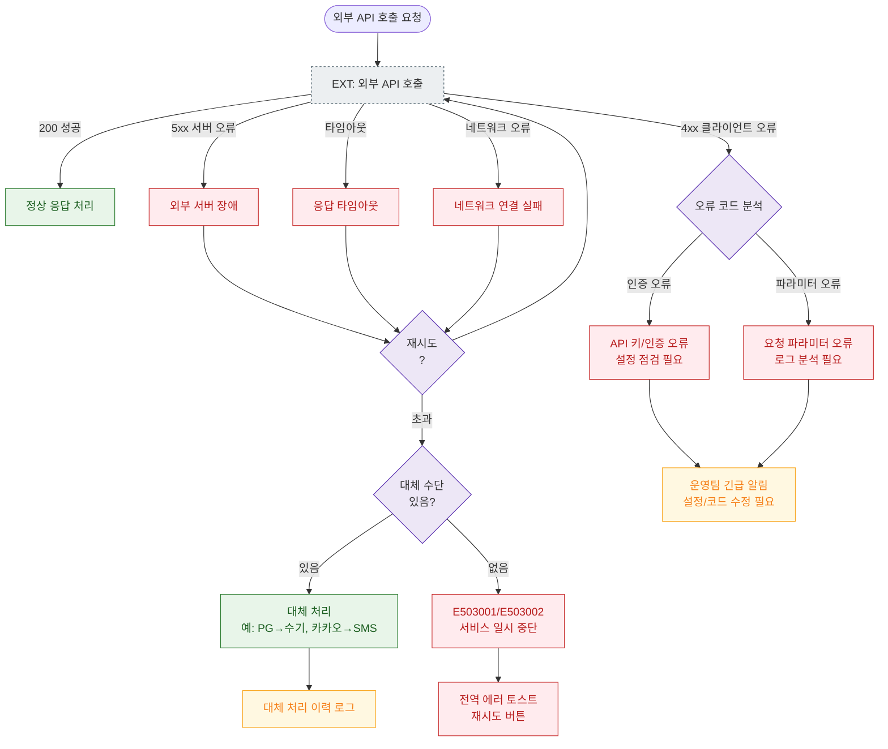

# E18 — 외부 API 실패

## 1. 개요

| 항목 | 내용 |
|------|------|
| 에러코드 | E503001 / E503002 |
| HTTP | 503 Service Unavailable |
| 발생 모듈 | 전 모듈 (외부 연동) |
| 영향 화면 | SCR-S003 결제, SCR-075 전자계약, SCR-083 IoT, SCR-071 메시지 |

## 2. 발생 조건

- PG사 API 장애
- 전자계약 외부 서비스 장애
- 세금계산서 발행 API 오류
- IoT 클라우드 플랫폼 장애
- SMS/카카오 발송 API 장애

## 3. 다이어그램

## 4. 복구/재시도 전략

| 상황 | 전략 |
|------|------|
| 5xx / 타임아웃 | 최대 3회 자동 재시도 (exponential backoff) |
| 대체 수단 있음 | 자동 fallback (카카오→SMS, PG→수기 등) |
| 대체 수단 없음 | 에러 토스트, 사용자 재시도 버튼 |
| API 인증 오류 | 운영팀 즉시 알림, 수동 설정 수정 |

## 5. 사용자 노출 메시지

| 에러코드 | 메시지 |
|----------|--------|
| E503001 | 결제 단말기 연결에 실패했습니다. 연결 상태를 확인해주세요 |
| E503002 | 결제 서비스에 일시적인 문제가 발생했습니다 |
| 일반 외부 API | 서비스에 일시적인 문제가 발생했습니다. 잠시 후 다시 시도해주세요 |
