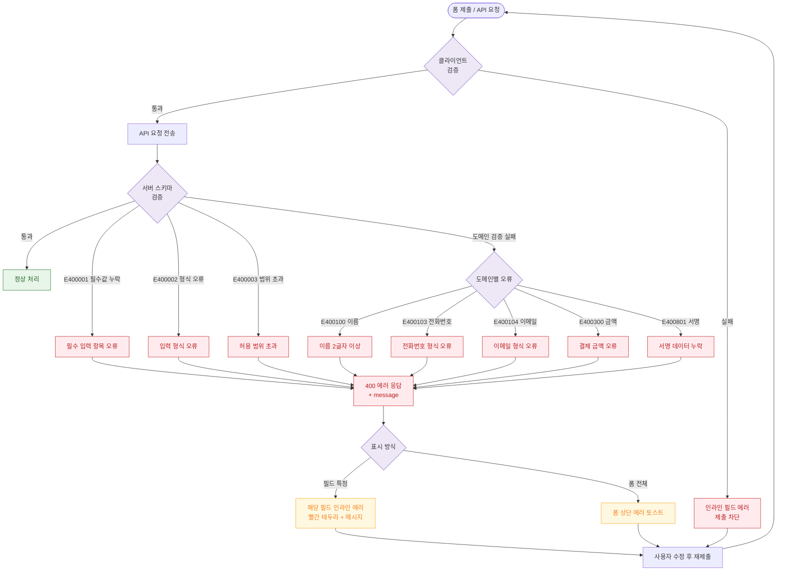

# E19 — 스키마 검증 실패

## 1. 개요

| 항목 | 내용 |
|------|------|
| 에러코드 | E400001 / E400002 / E400003 / E400100~E400106 / E400200 / E400300~E400302 / E400500~E400502 / E400700 / E400800~E400801 / E400900 / E400950 |
| HTTP | 400 Bad Request |
| 발생 모듈 | 전 모듈 |
| 영향 화면 | 등록/수정 폼이 있는 모든 화면 |

## 2. 발생 조건

- 필수 필드 누락 (E400001)
- 입력 형식 오류 — 이메일, 전화번호, 날짜 (E400002)
- 요청 범위 초과 — 파일 크기, 페이지 한도 (E400003)
- 도메인별 특수 검증 실패 (E400100~E400950)

## 3. 다이어그램

## 4. 복구/재시도 전략

| 상황 | 전략 |
|------|------|
| 클라이언트 검증 실패 | 제출 차단, 인라인 에러 즉시 표시 |
| 서버 검증 실패 | 기반 해당 필드 인라인 에러 |
| 다중 필드 오류 | 모든 오류 필드 동시 표시 |
| 수정 후 재제출 | 오류 필드만 재검증 |

## 5. 사용자 노출 메시지

| 에러코드 | 메시지 |
|----------|--------|
| E400001 | 필수 입력 항목을 확인해주세요 |
| E400002 | 입력 형식이 올바르지 않습니다 |
| E400003 | 허용된 범위를 초과했습니다 |
| E400100 | 이름은 2글자 이상 입력해주세요 |
| E400103 | 올바른 전화번호를 입력해주세요 |
| E400104 | 올바른 이메일 형식이 아닙니다 |
| E400300 | 결제 금액을 확인해주세요 |
| E400801 | 전자서명을 완료해주세요 |
