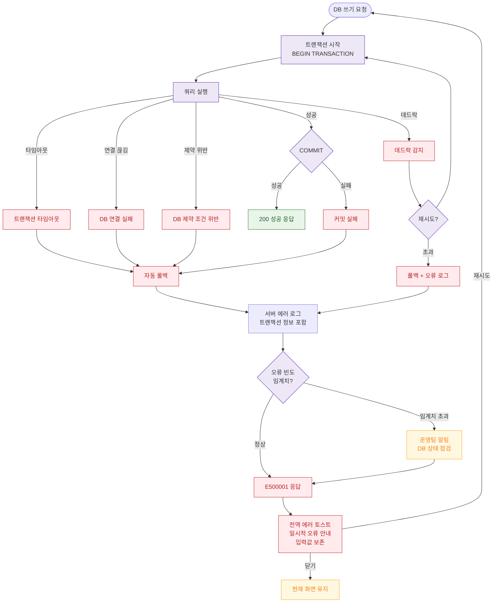

# E20 — DB 트랜잭션 실패

## 1. 개요

| 항목 | 내용 |
|------|------|
| 에러코드 | E500001 (DB 트랜잭션 실패) |
| HTTP | 500 Internal Server Error |
| 발생 모듈 | 전 모듈 |
| 영향 화면 | 저장/수정/삭제 작업이 있는 모든 화면 |

## 2. 발생 조건

- DB 연결 끊김
- 트랜잭션 타임아웃
- 데드락 발생
- 제약 조건 위반 (FK, UNIQUE 등 — 서버 미처리 시)
- DB 디스크 용량 부족
- 쿼리 실행 오류

## 3. 다이어그램

## 4. 복구/재시도 전략

| 상황 | 전략 |
|------|------|
| 데드락 | 자동 3회 재시도 (100ms, 200ms, 400ms backoff) |
| 타임아웃/연결 실패 | 즉시 롤백, 에러 로그, 재시도 버튼 |
| 제약 조건 위반 | 롤백, 상위 레이어 검증 코드 점검 |
| 반복 실패 | 운영팀 알림, DB 상태 점검 |
| 폼 입력 보존 | 롤백 시 클라이언트 입력값 유지 |

## 5. 사용자 노출 메시지

| 에러코드 | 메시지 |
|----------|--------|
| E500001 | 일시적인 오류가 발생했습니다. 잠시 후 다시 시도해주세요 |
| 재시도 권유 | 입력하신 내용은 유지됩니다. 다시 시도해주세요. |
