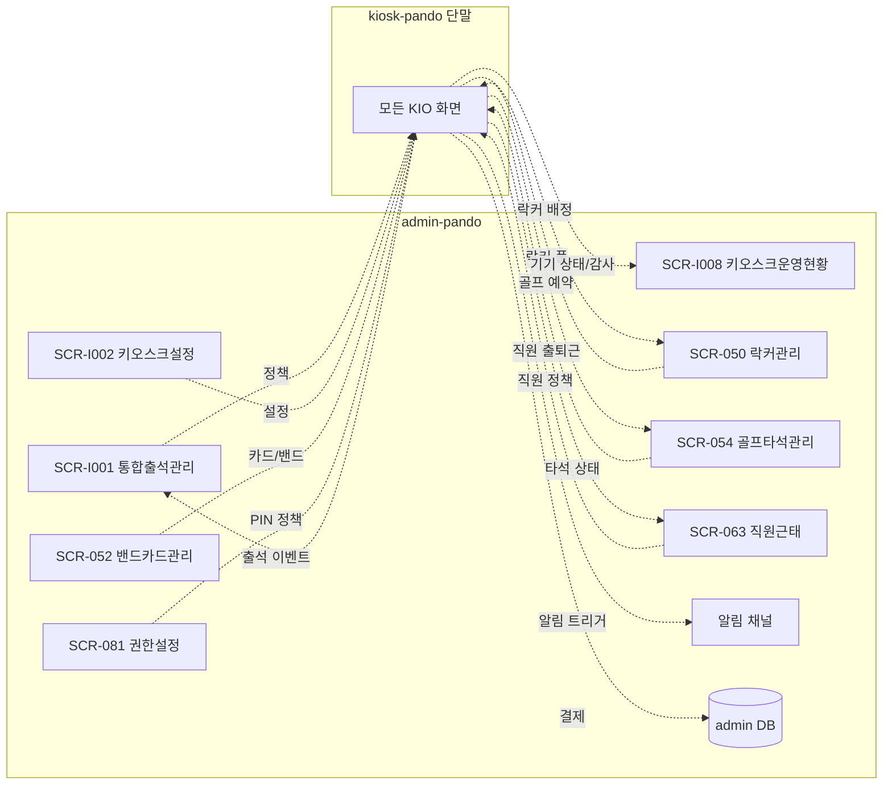
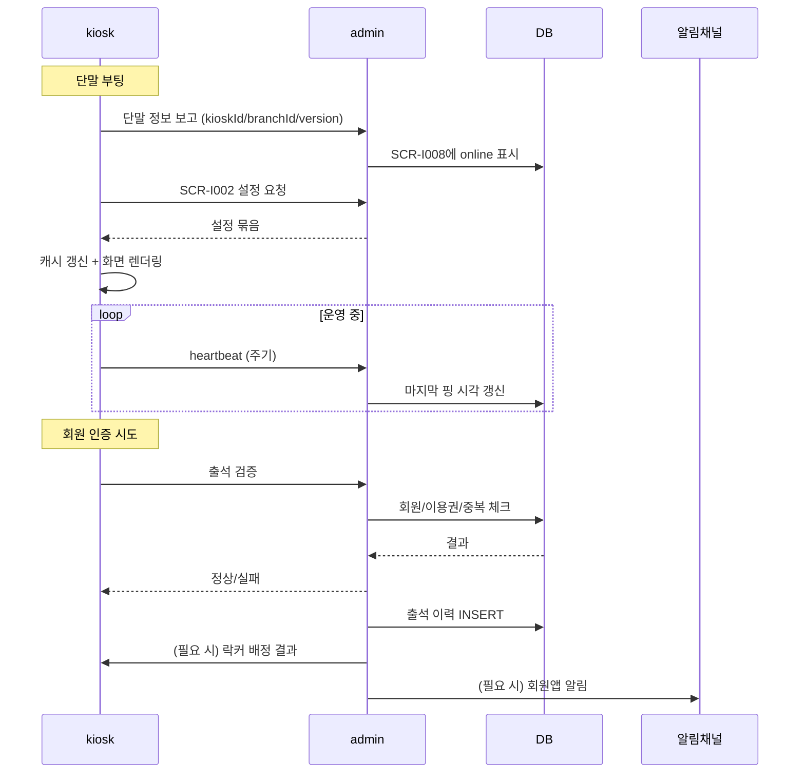

# admin ↔ kiosk 전체 데이터흐름

> 작성일: 2026-05-04
> admin 시점에서 키오스크 단말과 주고받는 모든 데이터/이벤트

## 1. 채널 역할

## 2. 책임 구분

| 책임 | admin | kiosk |
|---|---|---|
| 정책 정의 (출석/락커/골프) | ✅ 원천 | 표시/실행만 |
| 주차 안내/외부 링크 | 선택 설정 | 표시/이동만 |
| 마스터 데이터 (회원/이용권/카드 매핑) | ✅ 원천 | 캐시 |
| 설정값 (메뉴 토글/얼굴 정책/타이머) | ✅ 원천 | 수신 |
| 출석/예약/결제 이벤트 발생 | — | ✅ 발행 |
| 출석/예약/결제 이력 적재 | ✅ 적재 | — |
| 단말 상태/감사 로그 | ✅ 적재 | ✅ 발행 |
| 회원앱 알림 | ✅ 발송 | 트리거 요청 |
| 영구 저장소 | ✅ DB | ❌ 없음 |
| 오프라인 큐 | — | ✅ 일시 보유 |

## 3. 데이터/이벤트 카탈로그

### admin → kiosk (정책/마스터)

| 항목 | admin 화면 | 키오스크 영향 |
|---|---|---|
| 출석 처리 정책 | SCR-I001 | KIO-201 결과 분기 |
| 단말 설정 묶음 | SCR-I002 | 모든 KIO 화면 |
| 락커 풀 / 자동 배정 정책 | SCR-050 | KIO-201, KIO-202/204 |
| 카드/밴드 매핑 / 밴드 재고 | SCR-052 | KIO-102, KIO-204 |
| 골프 타석 상태/시간/대기 정책 | SCR-054 | KIO-501~504 |
| 직원 출퇴근 허용 | SCR-063 | KIO-104 분기 |
| 단말 PIN 정책 | SCR-081 | KIO-401 |
| 지점 공지 텍스트 | D08 마케팅 | KIO-001 배너, KIO-305 |

### kiosk → admin (이벤트)

| 이벤트 | 키오스크 화면 | admin 적재 |
|---|---|---|
| 회원 출석 성공/실패 | KIO-201 | SCR-I001 출석 이력 |
| 직원 출퇴근 | KIO-104 → KIO-201 | SCR-063 staffAttendance |
| 락커 자동 배정 | KIO-201 → KIO-202/204 | SCR-050 락커 풀 갱신 |
| 락커 앱 발송 트리거 | KIO-203 | 알림 채널 + 발송 로그 |
| 골프 예약 확정/대기 | KIO-503/504 | SCR-054 |
| 매점 결제 | KIO-702 | SCR-S010 현장판매 |
| 관리자 액션 (PIN/문열기/TTS) | KIO-402 | SCR-I008 감사 로그 |
| 단말 heartbeat | (백그라운드) | SCR-I008 단말 상태 |

## 4. 시퀀스 — 단말 부팅 ~ 운영

## 5. 데이터 일관성 원칙

1. **단일 원천**: 회원/이용권/예약/락커/카드 매핑은 admin DB만 사용
2. **정책 우선**: 출석/락커/골프 운영 규칙은 admin 정책 우선, 키오스크는 표시/입력
3. **이벤트는 admin 적재**: 키오스크 이벤트는 모두 admin 운영 로그
4. **주차 예외**: 주차는 admin 원천/이력 적재 필수 대상이 아니며, 필요한 지점에서만 안내 문구나 외부 링크를 선택 설정
5. **신규 설정 키 합의**: 키오스크 신규 요구는 SCR-I002에 명시 후 수신
6. **오프라인 큐**: 일시 단절 시 키오스크 로컬 큐, 복구 즉시 admin 반영

## 관련 산출물

- KIOSK-연동매트릭스.md
- ../../kiosk/다이어그램/60_admin_연동/60_admin_데이터흐름.md (키오스크 시점 동일 흐름)
