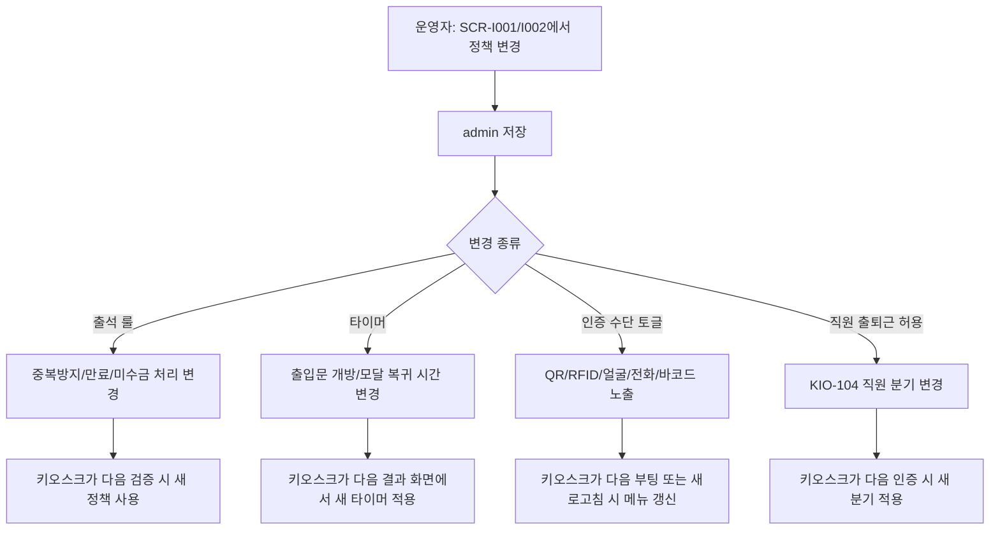
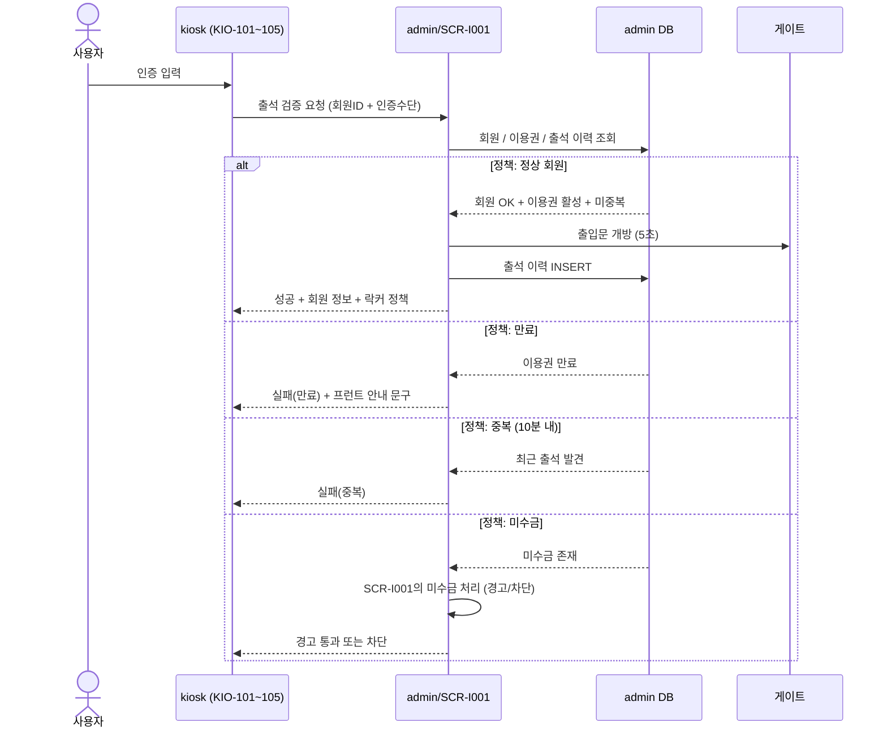
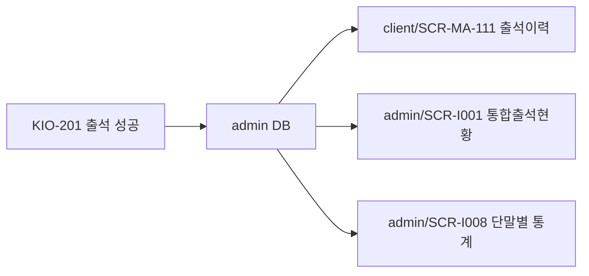

# 출석 정책의 키오스크 반영

> 작성일: 2026-05-04
> SCR-I001 통합출석관리 정책이 키오스크 단말에서 어떻게 실행되는지

## 1. 정책 → 단말 적용 흐름

## 2. 검증 시퀀스

## 3. 정책 변경의 즉시성 매트릭스

| 정책 항목 | 변경 적용 시점 | 키오스크 동작 |
|---|---|---|
| 중복 방지 시간 | 다음 검증 즉시 | admin이 매번 정책을 적용해 결정 |
| 출입문 개방 시간 | 다음 검증 즉시 | admin이 게이트 명령에 포함 |
| 성공 모달 자동 복귀 | 단말 캐시 갱신 후 | 설정 새로고침 또는 polling |
| 인증 수단 토글 | 단말 캐시 갱신 후 | 메뉴 노출 갱신 |
| 직원 출퇴근 허용 | 다음 검증 즉시 | admin이 분기 신호 반환 |
| 미수금 차단 정책 | 다음 검증 즉시 | admin이 경고/차단 결정 |

## 4. 출석 결과의 다채널 반영

키오스크에서 일어난 출석은 회원앱과 admin 양쪽에서 동일하게 즉시 조회 가능하다.

## 관련 산출물

- ../../화면설계서/D11-통합운영/SCR-I001-통합출석관리/키오스크-연동.md
- ../../../kiosk/다이어그램/20_상태전이도/21_출석_상태전이.md
- ../../../kiosk/다이어그램/30_시나리오_시퀀스/X01, X02, X03
