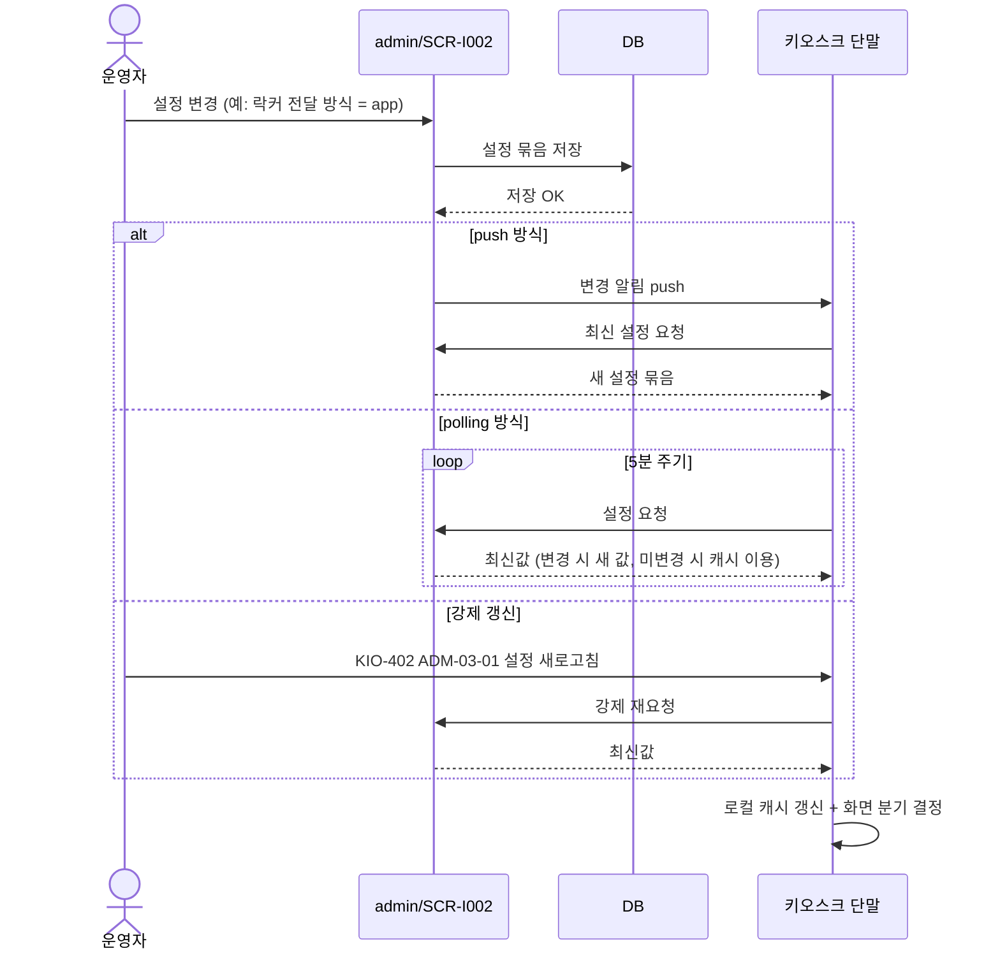
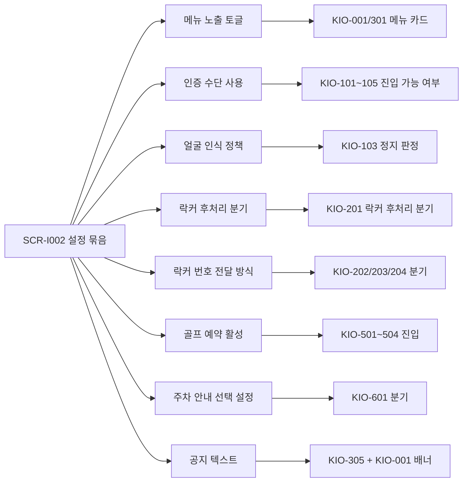
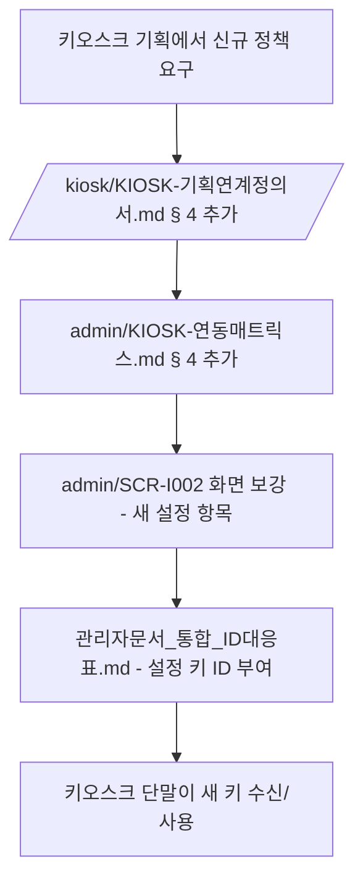
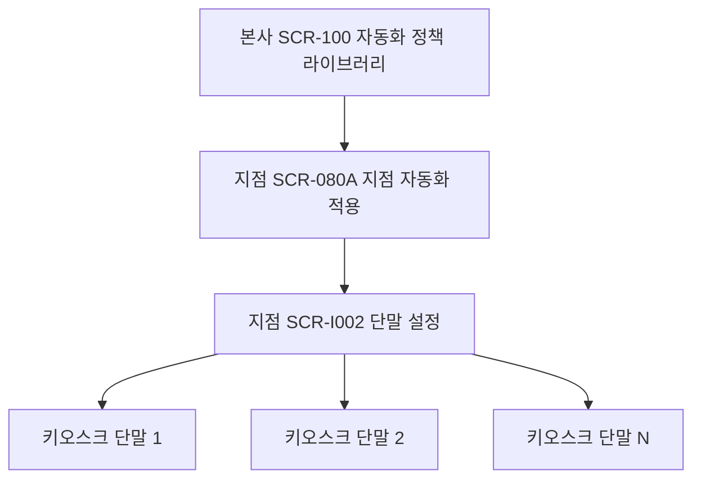
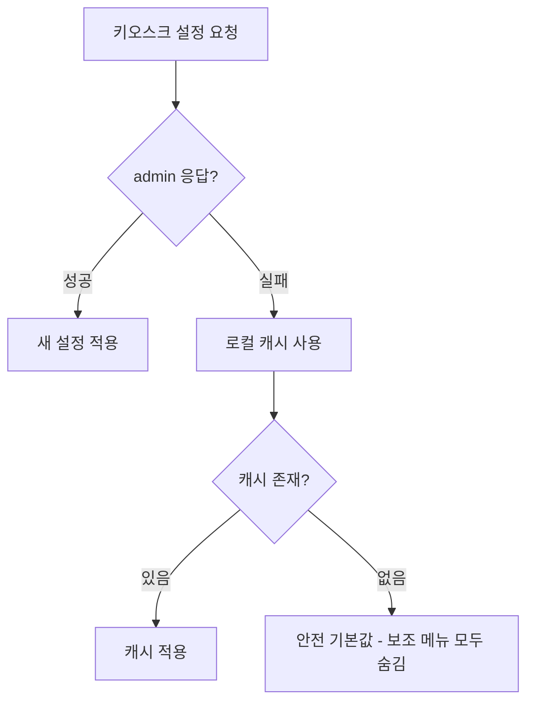

# 키오스크 설정 관리 흐름

> 작성일: 2026-05-04
> SCR-I002 키오스크설정 변경이 단말에 반영되는 전 과정

## 1. 설정 변경 → 단말 반영

## 2. 설정 묶음 → 화면 영향 매트릭스

## 3. 신규 설정 키 합의 흐름

키오스크가 새로 요구하는 설정 키는 admin/SCR-I002에 명시되어야 한다.

## 4. 단말별 vs 지점별 설정 분리

| 분류 | 설정 항목 | 적용 단위 |
|---|---|---|
| 단말 단위 | 얼굴 인식 ON/OFF, 인증 수단, 메뉴 노출 | 키오스크 1대 |
| 지점 단위 | 출석 정책, 직원 출퇴근, 골프 정책, 공지 | 지점 모든 단말 |
| 지점 선택 | 주차 안내 문구, 외부 링크, 프런트 호출 안내 | 필요한 지점의 단말 |
| 본사 단위 | 자동화 정책 라이브러리, 정책 세트 | 모든 지점 |

## 5. 캐시/오프라인 정책

## 관련 산출물

- ../../화면설계서/D11-통합운영/SCR-I002-키오스크설정/키오스크-연동.md
- ../../../kiosk/기능명세서/설정및외부연동.md
- ../../../kiosk/다이어그램/40_자동화/40_자동복귀_자동배정.md § 4
