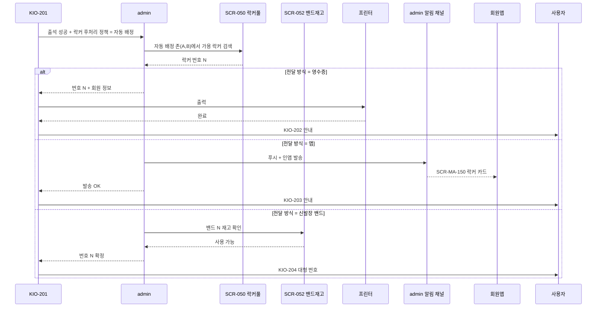
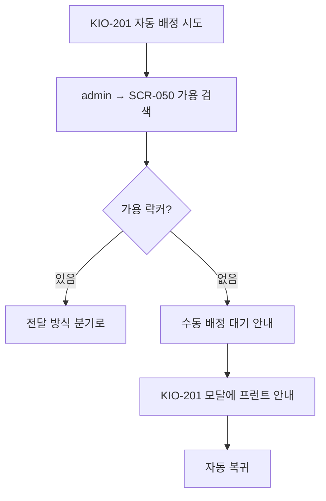
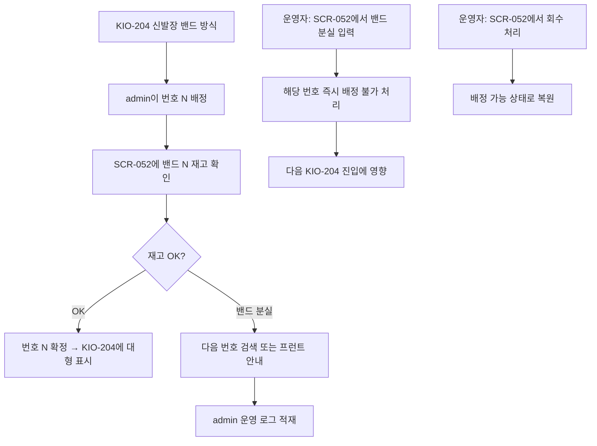
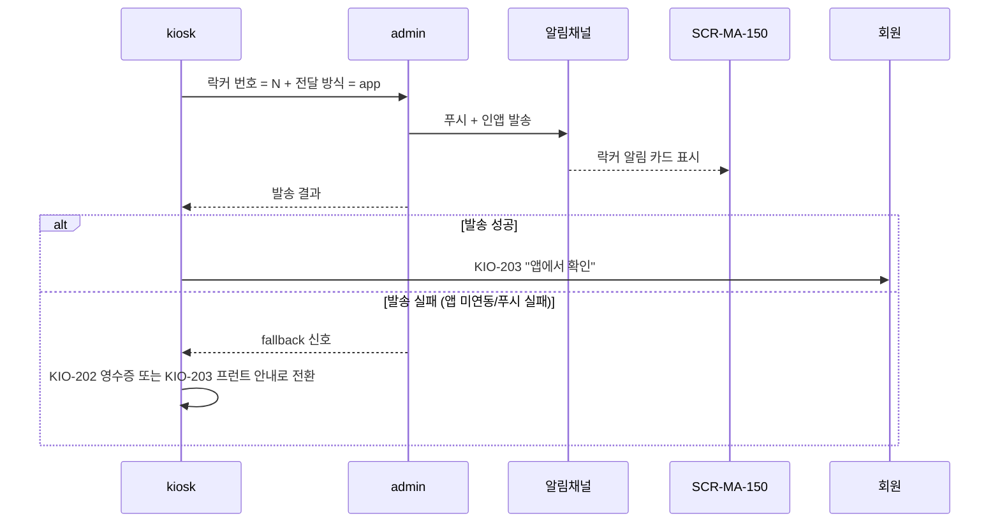

# 락커 자동 배정 — kiosk 흐름

> 작성일: 2026-05-04
> SCR-050 락커관리 + SCR-052 밴드카드관리 ↔ KIO-201/202/204 연동

## 1. 락커 자동 배정 시퀀스

## 2. 자동 배정 실패 분기

## 3. 신발장 밴드 방식의 SCR-052 의존

## 4. 회원 앱 발송 방식의 알림 채널

## 5. 락커 풀 갱신 타이밍

| 트리거 | SCR-050 갱신 |
|---|---|
| 키오스크 자동 배정 | 즉시 (락커 점유) |
| 회원이 락커 회수 (퇴장) | admin/SCR-050 운영자 회수 처리 |
| 일괄 회수 (영업 종료) | admin/SCR-050 일괄 회수 |
| 자동 만료 | 운영 정책에 따라 (영업 종료 시각 등) |

## 관련 산출물

- ../../화면설계서/D06-시설관리/SCR-050-락커관리/키오스크-연동.md
- ../../화면설계서/D06-시설관리/SCR-052-밴드카드관리/키오스크-연동.md
- ../../../kiosk/다이어그램/20_상태전이도/22_락커후처리_상태전이.md
- ../../../kiosk/다이어그램/30_시나리오_시퀀스/X04, X05, X06
