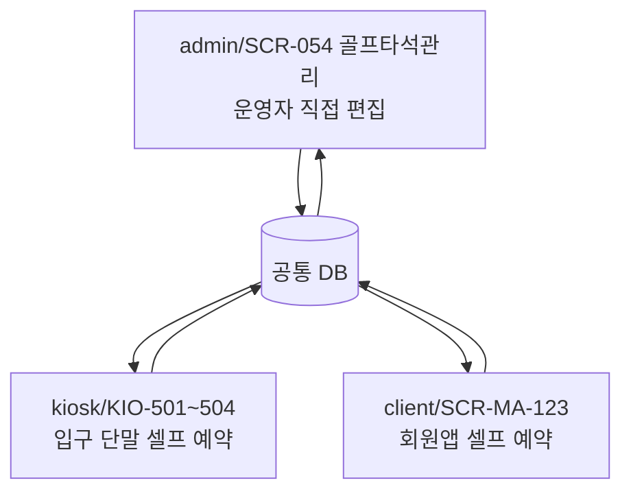
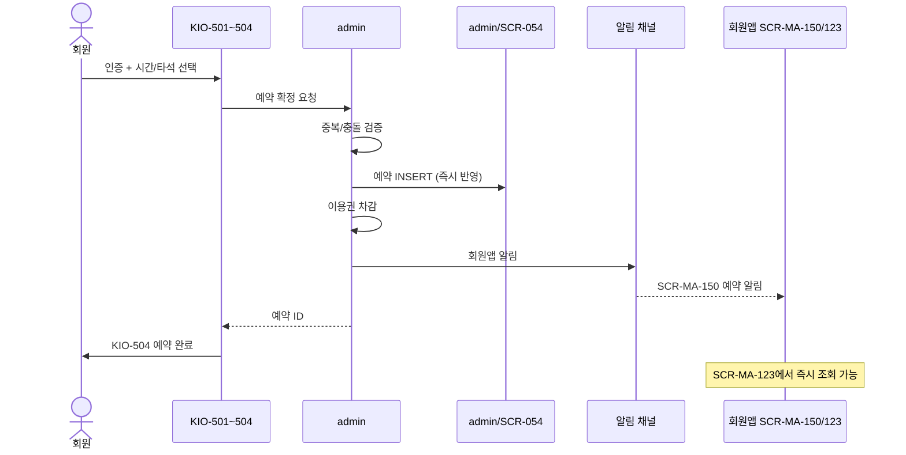
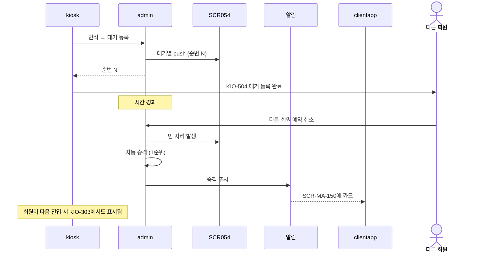
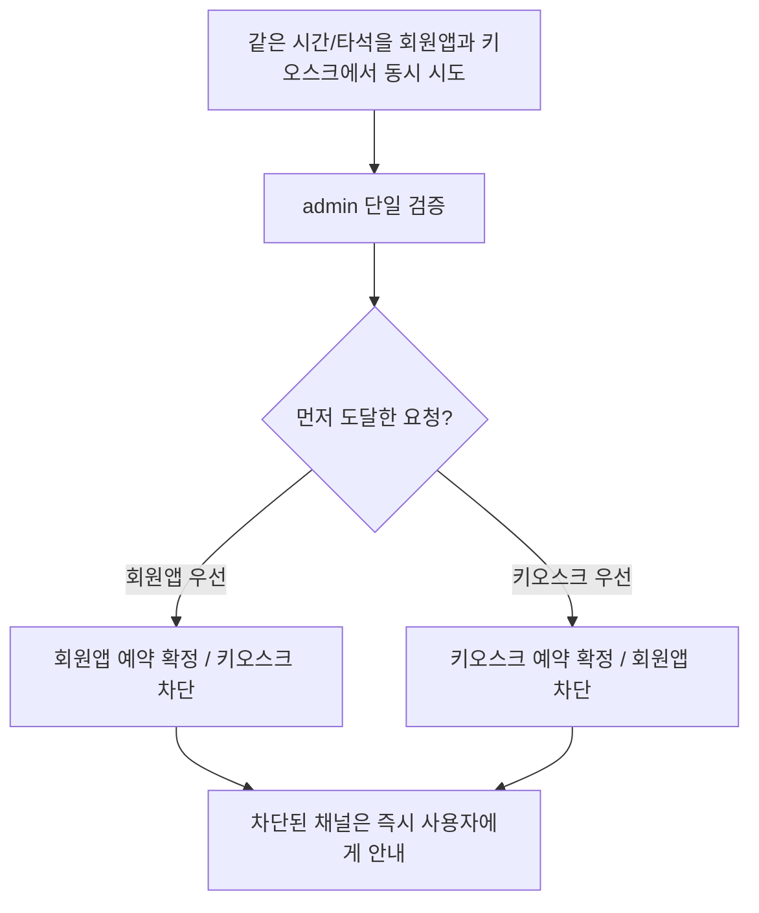
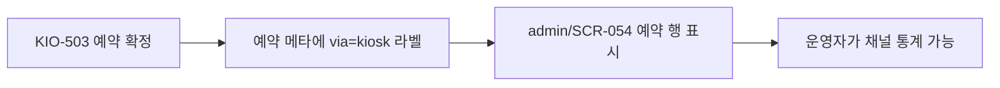
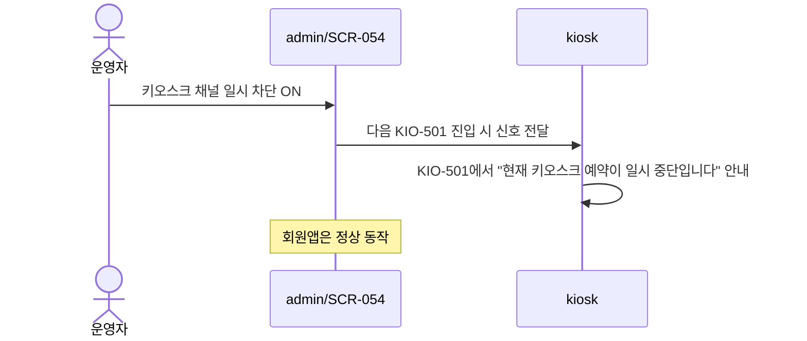

# 골프 타석 — kiosk 예약 반영

> 작성일: 2026-05-04
> SCR-054 골프타석관리 ↔ KIO-501~504 ↔ client/SCR-MA-123 동기화

## 1. 3채널 동기화 구조

세 채널은 동일 데이터 원천을 본다. 어디서 예약/취소해도 즉시 반영되며, 키오스크는 로컬 상태만으로 예약을 확정하지 않는다.

## 2. 키오스크 예약 시퀀스

## 3. 대기 등록 + 자동 승격

## 4. 동시 시도 충돌 방지

admin이 단일 검증을 수행하므로 충돌은 발생하지 않는다. KIO-501~504의 골프 UX는 타석 상태, 대기열, 이용권 차감, 채널 차단 정책을 모두 admin 결과에 맞춰 표시한다.

## 5. SCR-054에 키오스크 채널 표시

## 6. 키오스크 채널 일시 차단 (점검 시)

## 관련 산출물

- ../../화면설계서/D06-시설관리/SCR-054-골프타석관리/키오스크-연동.md
- ../../../client/화면설계서/D12-회원앱/SCR-MA-123-골프예약상세/키오스크-연동.md
- ../../../kiosk/다이어그램/20_상태전이도/23_골프예약_상태전이.md
- ../../../kiosk/다이어그램/30_시나리오_시퀀스/X07, X08
- 30_시나리오_시퀀스/X31_회원앱_골프예약_타석선택_대기전환.md
