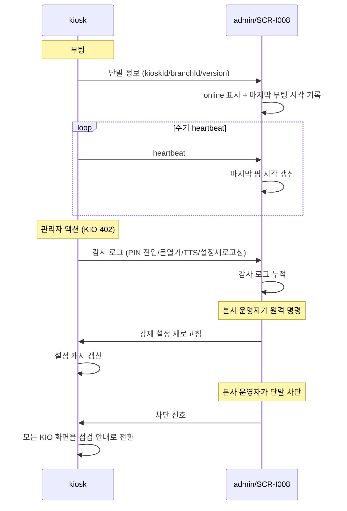
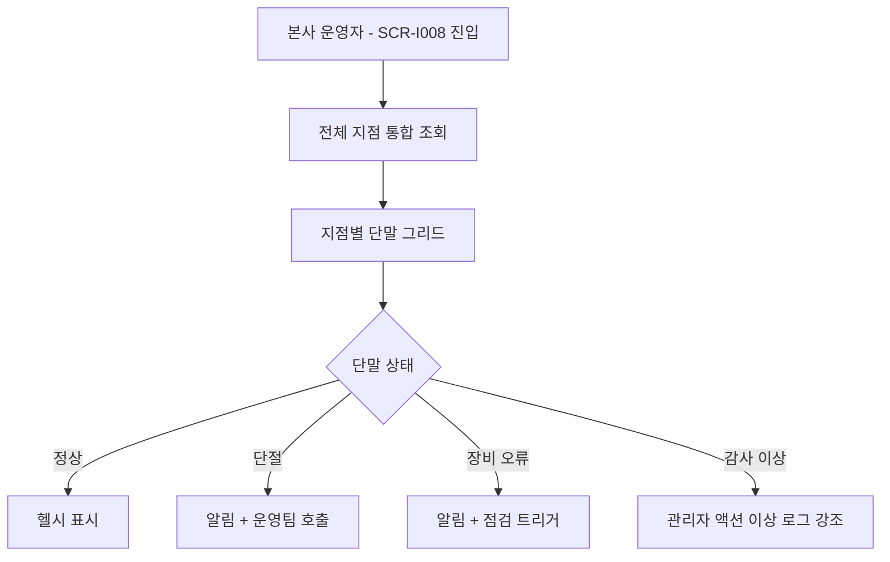

# 키오스크 단말 운영 현황

> 작성일: 2026-05-04
> SCR-I008 키오스크운영현황과 키오스크 단말의 양방향 통신

## 1. 단말 라이프사이클

## 2. 양방향 통신

## 3. SCR-I008 표시 항목

| 항목 | 데이터 출처 |
|---|---|
| kioskId / branchId / version | kiosk → admin (부팅 시) |
| 온라인 상태 | heartbeat 마지막 시각 |
| 마지막 출석 처리 시각 | 출석 이벤트 발생 시각 |
| 감사 로그 | KIO-402 운영자 액션 |
| 장비 상태 | 카메라/프린터/리더기/게이트/TTS 오류 보고 |
| 오프라인 큐 잔여 | 단절 시 적재된 큐 카운트 |

## 4. 본사 통합 모니터링

## 5. 원격 명령 카탈로그

| 명령 | 발신 | 키오스크 영향 |
|---|---|---|
| 강제 설정 새로고침 | admin/SCR-I008 | 즉시 새 설정 적용 |
| 단말 비활성/활성 토글 | admin/SCR-I002 | 모든 KIO 화면이 점검 안내로 |
| 원격 재기동 | admin/SCR-I008 | 단말 재부팅 |
| 원격 문 열기 | admin/SCR-I008 | 게이트 개방 (예외 대응) |
| 감사 로그 일괄 다운로드 | admin/SCR-I008 | — (조회만) |

## 6. 감사 로그 카테고리

| 카테고리 | 발생 화면 | 예시 |
|---|---|---|
| PIN 진입 | KIO-401 | 성공/실패 |
| 운영 액션 | KIO-402 | 설정새로고침/연결테스트/문열기/TTS |
| 장비 이벤트 | (백그라운드) | 카메라 차단, 프린터 오류 |
| 출석 이상 | KIO-201 | 미식별 다발, 직원 출퇴근 차단 |
| 결제 이상 | KIO-702 | 실패/재시도/취소 |

## 관련 산출물

- ../../화면설계서/D11-통합운영/SCR-I008-키오스크운영현황/키오스크-연동.md
- ../../../kiosk/기능명세서/관리자및운영관리.md
- ../../../kiosk/다이어그램/50_에러_예외/50_인증실패_장비오프라인.md
