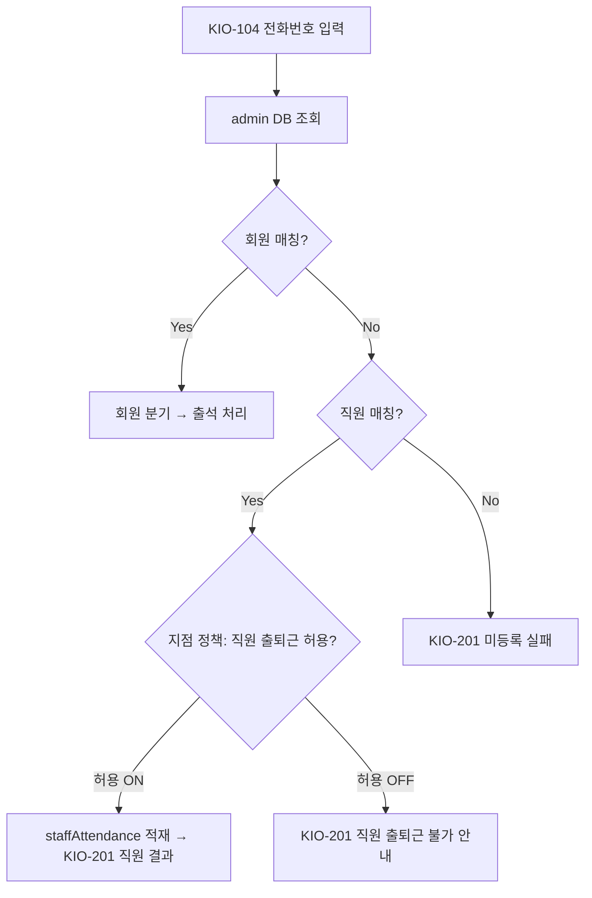
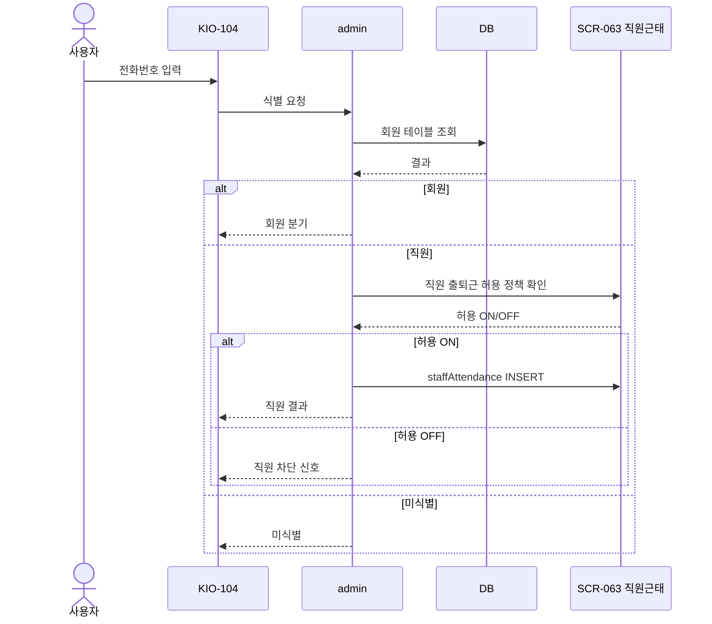
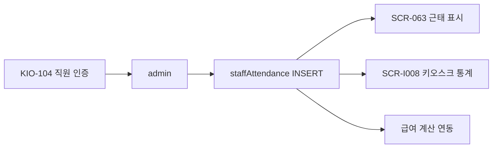

# 직원 근태 — kiosk 체크인 분기

> 작성일: 2026-05-04
> SCR-063 직원근태관리 ↔ KIO-104 전화번호 체크인 자동 분기

## 1. 회원/직원 자동 분기 흐름

## 2. 시퀀스

## 3. SCR-063 운영자 화면 영향

운영자가 SCR-063에서 다음을 변경하면 키오스크 동작이 즉시 바뀐다.

| SCR-063 변경 | 키오스크 영향 |
|---|---|
| 직원 출퇴근 허용 토글 | KIO-104 직원 분기 차단/허용 |
| 직원 퇴사 처리 (SCR-062) | 해당 전화번호의 직원 매칭 차단 |
| 신규 직원 등록 | 신규 직원이 KIO-104에서 출퇴근 가능 |
| 근무 시간 외 차단 정책 (옵션) | 시간 외 키오스크 출퇴근 거부 |

## 4. 채널별 직원 출퇴근 비교

| 채널 | 직원 출퇴근 |
|---|---|
| admin 화면(직접 입력) | SCR-063 화면 (운영자가 일괄 입력 가능) |
| 키오스크 KIO-104 | 같은 화면에서 자동 분기 (직원이 자기 번호 입력) |
| 회원앱 | 직원 채널 별도 (FC/스태프 로그인) |

## 5. 직원 출퇴근 데이터 일관성

## 관련 산출물

- ../../화면설계서/D07-직원관리/SCR-063-직원근태관리
- ../../../kiosk/화면설계서/A1-메인및출석/KIO-104-전화번호체크인/00-기본화면.md
- ../../../kiosk/다이어그램/30_시나리오_시퀀스/X03_전화번호_출석_직원분기.md
