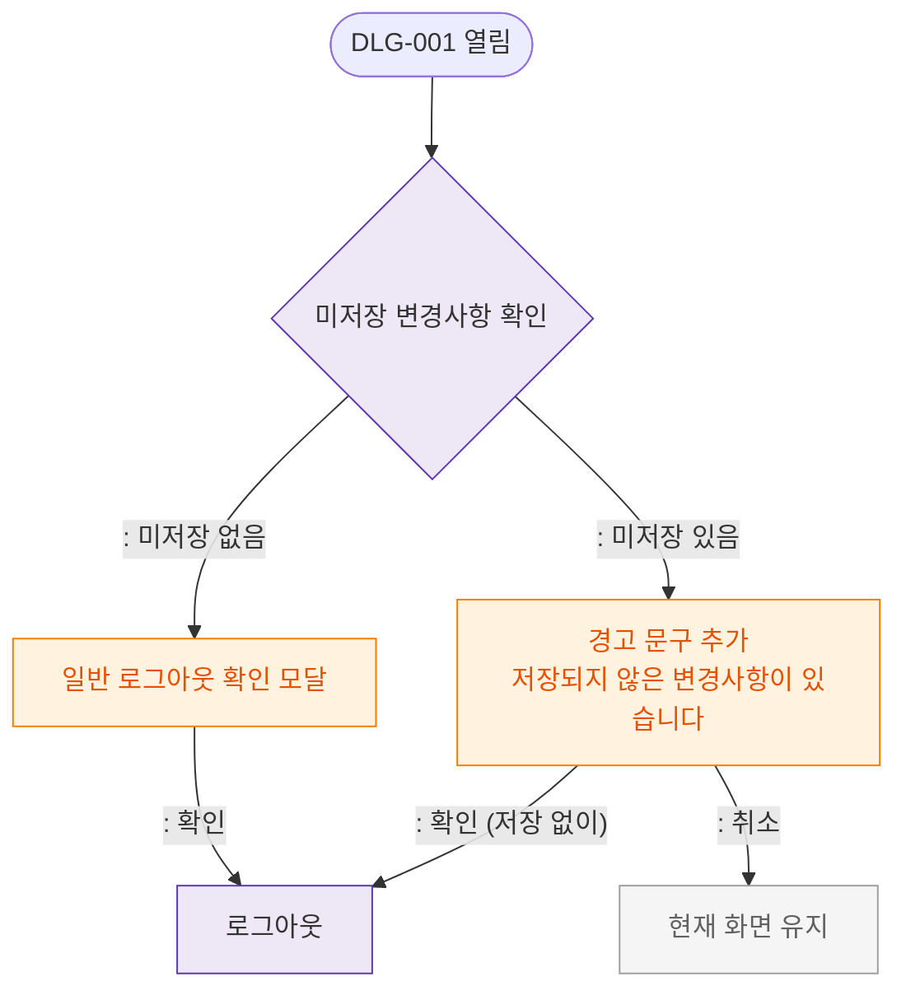

# M2 필드검증 플로우 — DLG-001 로그아웃 확인

## 목적
로그아웃 확인 모달은 입력 필드가 없으므로 검증 로직 없음. 미저장 변경사항 경고 조건을 정의한다.

## 다이어그램

## TC 후보

| TC ID | 타입 | Given | When | Then |
|-------|------|-------|------|------|
| TC-D001-M2-01 | positive | manager (미저장 없음) | 로그아웃 클릭 | 일반 확인 모달 |
| TC-D001-M2-02 | exception | manager (미저장 있음) | 로그아웃 클릭 | 경고 문구 포함 모달 |
| TC-D001-M2-03 | positive | manager | 경고 모달 확인 | 미저장 버리고 로그아웃 |
