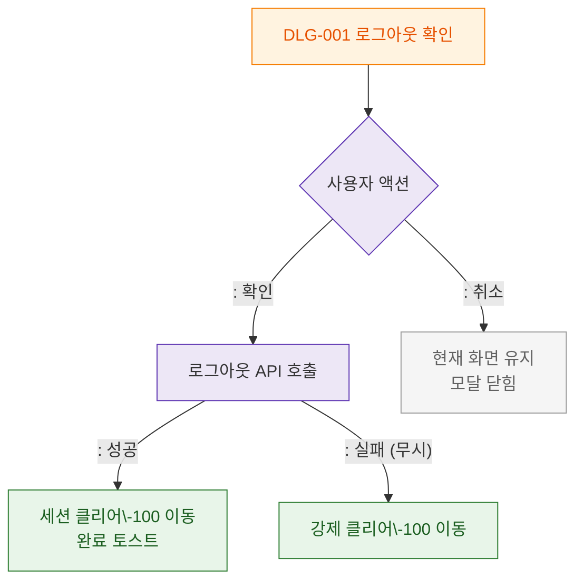

# M3 결과분기 플로우 — DLG-001 로그아웃 확인

## 목적
확인/취소 결과에 따른 분기와 로그아웃 API 성공/실패 처리를 정의한다.

## 다이어그램

## TC 후보

| TC ID | 타입 | Given | When | Then |
|-------|------|-------|------|------|
| TC-D001-M3-01 | positive | manager | 확인 + API 성공 | 세션 클리어 + SCR-100 + 토스트 |
| TC-D001-M3-02 | negative | manager | 확인 + API 실패 | 강제 클리어 + SCR-100 |
| TC-D001-M3-03 | positive | manager | 취소 | 현재 화면 유지 |
