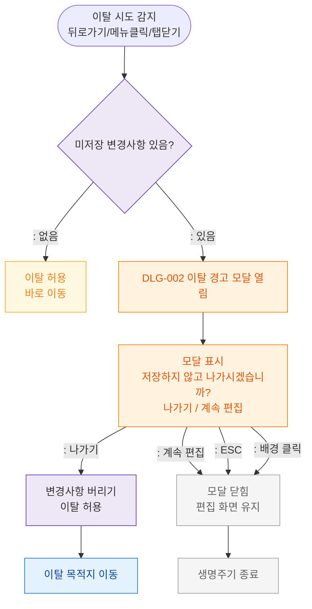

# M1 생명주기 플로우 — DLG-002 이탈 경고

## 목적
폼 편집 중 이탈 시도 → 경고 모달 → 이탈/유지 분기 생명주기를 정의한다.

## 다이어그램

## TC 후보

| TC ID | 타입 | Given | When | Then |
|-------|------|-------|------|------|
| TC-D002-M1-01 | positive | manager (미저장 없음) | 이탈 시도 | 바로 이동 허용 |
| TC-D002-M1-02 | positive | manager (미저장 있음) | 이탈 시도 | DLG-002 경고 모달 열림 |
| TC-D002-M1-03 | positive | manager | 나가기 버튼 | 변경사항 버리고 이동 |
| TC-D002-M1-04 | positive | manager | 계속 편집 / ESC | 모달 닫힘 + 편집 유지 |
