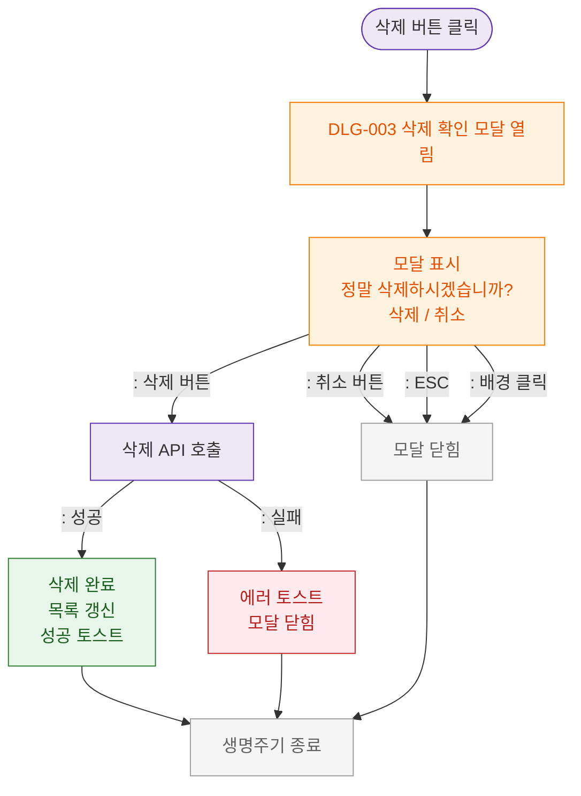

# M1 생명주기 플로우 — DLG-003 삭제 확인

## 목적
삭제 버튼 클릭 → 확인 모달 → 삭제 실행/취소 생명주기를 정의한다.

## 다이어그램

## TC 후보

| TC ID | 타입 | Given | When | Then |
|-------|------|-------|------|------|
| TC-D003-M1-01 | positive | manager | 삭제 버튼 클릭 | DLG-003 열림 |
| TC-D003-M1-02 | positive | manager | 삭제 확인 | 삭제 완료 + 성공 토스트 |
| TC-D003-M1-03 | positive | manager | 취소 | 모달 닫힘 |
| TC-D003-M1-04 | negative | manager | 삭제 API 실패 | 에러 토스트 |
