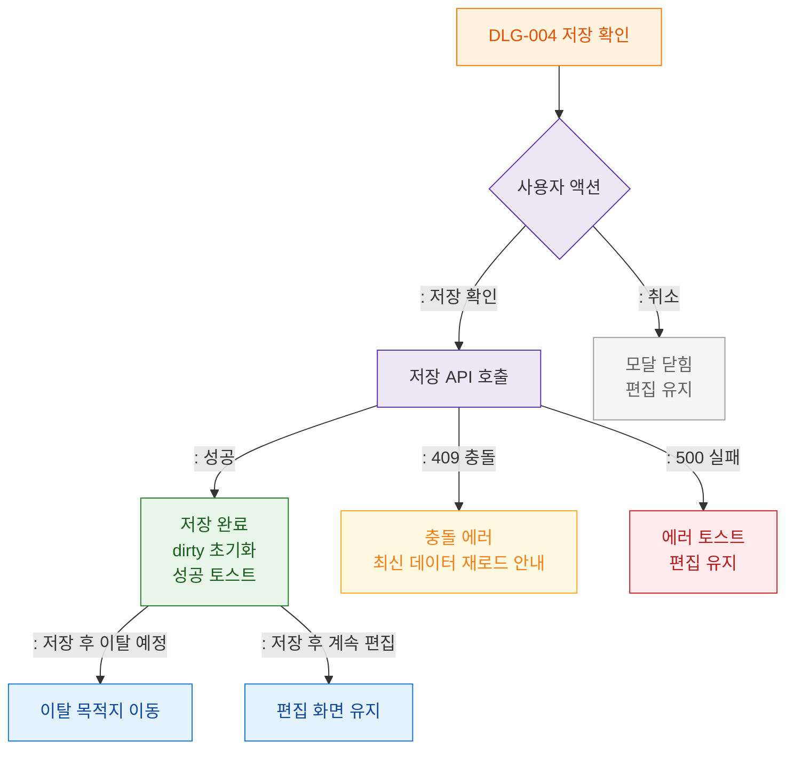

# M3 결과분기 플로우 — DLG-004 저장 확인

## 목적
저장 확인/취소 결과 분기와 저장 후 화면 처리를 정의한다.

## 다이어그램

## TC 후보

| TC ID | 타입 | Given | When | Then |
|-------|------|-------|------|------|
| TC-D004-M3-01 | positive | manager | 저장 성공 | dirty 초기화 + 성공 토스트 |
| TC-D004-M3-02 | positive | manager | 저장 후 이탈 | 이탈 목적지 이동 |
| TC-D004-M3-03 | negative | manager | 저장 API 실패 | 에러 토스트 + 편집 유지 |
| TC-D004-M3-04 | exception | manager | 409 충돌 | 충돌 에러 + 재로드 안내 |
| TC-D004-M3-05 | positive | manager | 취소 | 편집 유지 |
