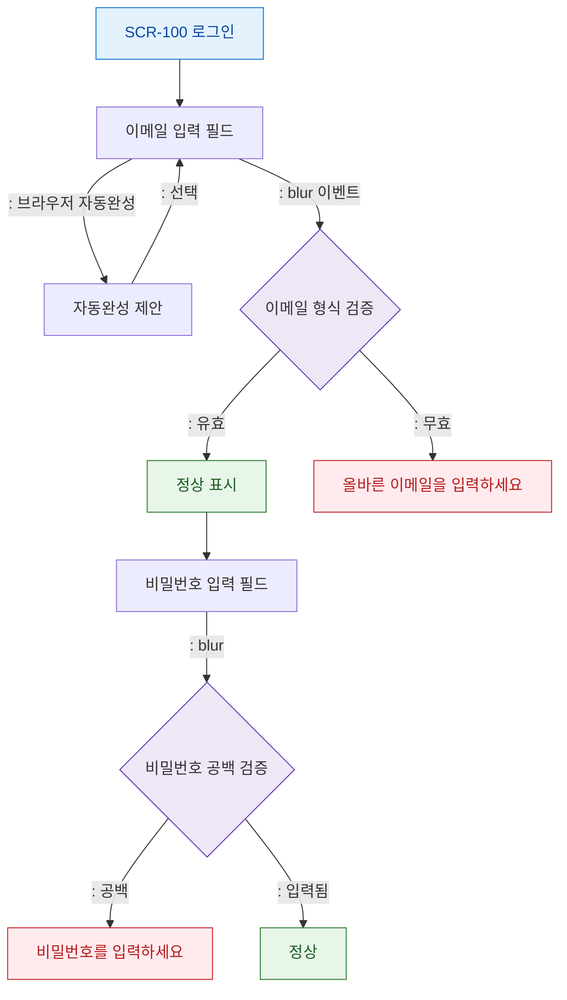

# F4 자동완성/입력 보조 플로우 — SCR-100 로그인

## 다이어그램

## TC 후보
| TC ID | 타입 | Given | When | Then |
|-------|------|-------|------|------|
| TC-100-F4-01 | negative | 이메일 필드 | blur시 형식 오류 | 에러 메시지 표시 |
| TC-100-F4-02 | negative | 비밀번호 필드 | blur시 공백 | 에러 메시지 표시 |
