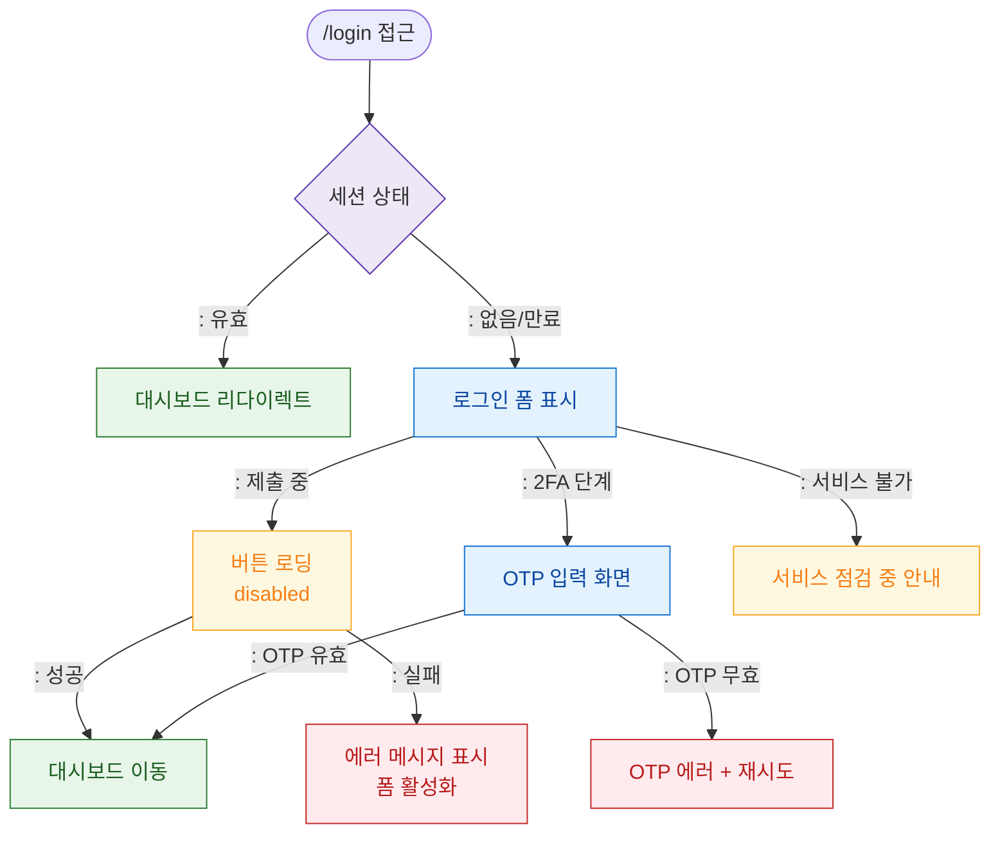

# F6 상태별 화면 플로우 — SCR-100 로그인

## 다이어그램

## TC 후보
| TC ID | 타입 | Given | When | Then |
|-------|------|-------|------|------|
| TC-100-F6-01 | positive | 로그인 제출 중 | 버튼 클릭 | 로딩 상태, 버튼 disabled |
| TC-100-F6-02 | positive | 2FA 단계 | OTP 유효 | 대시보드 이동 |
| TC-100-F6-03 | negative | 2FA 단계 | OTP 무효 | OTP 에러 + 재시도 |
