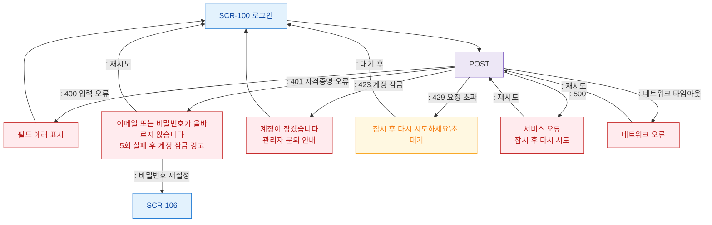

# F8 에러/예외/복구 플로우 — SCR-100 로그인

## 다이어그램

## TC 후보
| TC ID | 타입 | Given | When | Then |
|-------|------|-------|------|------|
| TC-100-F8-01 | negative | 잘못된 자격증명 | 로그인 | 401 에러 메시지 |
| TC-100-F8-02 | negative | 5회 실패 후 | 로그인 시도 | 423 계정 잠금 |
| TC-100-F8-03 | negative | 빠른 반복 시도 | 로그인 | 429 요청 초과 |
