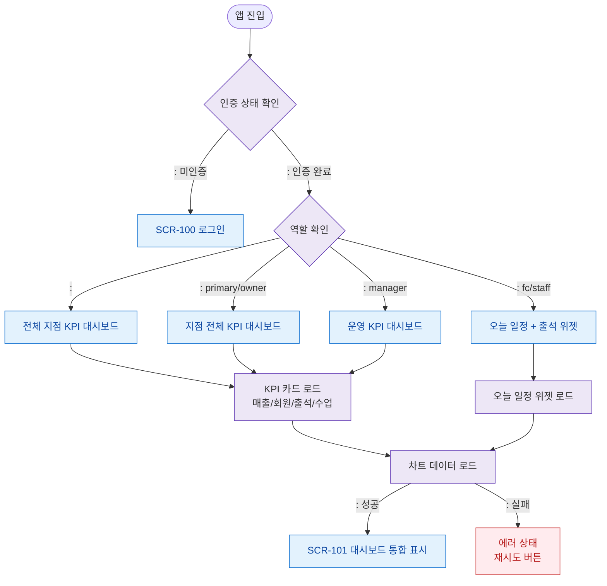

# F1 진입 플로우 — SCR-101 대시보드 통합

## 목적
로그인 성공 후 역할별 대시보드 진입 경로와 초기 데이터 로드 순서를 정의한다.

## 다이어그램

## TC 후보

| TC ID | 타입 | Given | When | Then |
|-------|------|-------|------|------|
| TC-101-F1-01 | positive | manager (로그인 완료) | 앱 진입 | 운영 KPI 대시보드 표시 |
| TC-101-F1-02 | positive | | 앱 진입 | 전체 지점 KPI 대시보드 표시 |
| TC-101-F1-03 | positive | staff | 앱 진입 | 오늘 일정 + 출석 위젯 표시 |
| TC-101-F1-04 | negative | (미인증) | 앱 직접 진입 | SCR-100 로그인 리다이렉트 |
| TC-101-F1-05 | negative | manager | KPI 로드 실패 | 에러 상태 + 재시도 버튼 |
