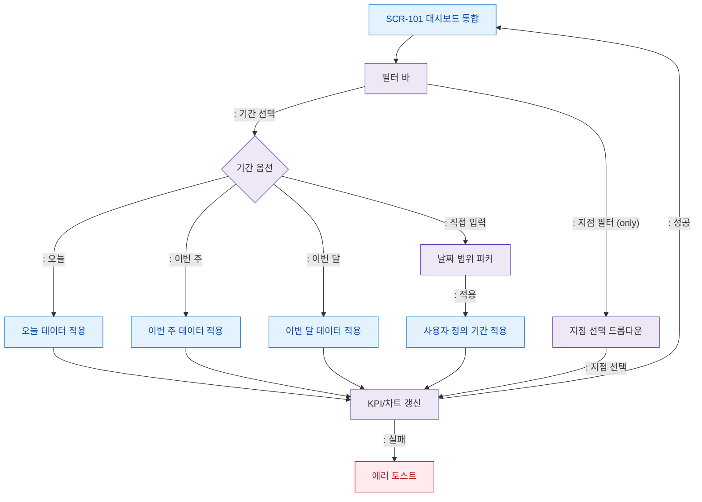

# F4 필터/검색 플로우 — SCR-101 대시보드 통합

## 목적
대시보드 기간 필터, 지점 필터(), 위젯 검색 필터 동작을 정의한다.

## 다이어그램

## TC 후보

| TC ID | 타입 | Given | When | Then |
|-------|------|-------|------|------|
| TC-101-F4-01 | positive | manager | 기간 필터 '이번 달' 선택 | 이번 달 KPI 갱신 |
| TC-101-F4-02 | positive | manager | 날짜 범위 직접 입력 후 적용 | 사용자 정의 기간 데이터 로드 |
| TC-101-F4-03 | positive | | 지점 필터 선택 | 선택 지점 KPI 표시 |
| TC-101-F4-04 | negative | owner | 지점 필터 UI 표시 여부 | 지점 필터 미노출 ( 전용) |
| TC-101-F4-05 | negative | manager | 갱신 중 API 실패 | 에러 토스트 표시 |
