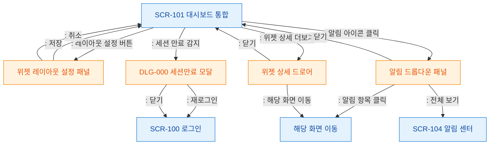

# F5 모달 트리거 트리 — SCR-101 대시보드 통합

## 목적
대시보드에서 발생하는 모달/패널 트리거 경로를 정의한다.

## 다이어그램

## TC 후보

| TC ID | 타입 | Given | When | Then |
|-------|------|-------|------|------|
| TC-101-F5-01 | positive | manager | 레이아웃 설정 버튼 클릭 | 위젯 레이아웃 패널 열림 |
| TC-101-F5-02 | positive | manager | 알림 아이콘 클릭 | 알림 드롭다운 패널 열림 |
| TC-101-F5-03 | negative | manager | 세션 만료 감지 | DLG-000 세션만료 모달 표시 |
| TC-101-F5-04 | positive | manager | 위젯 상세 더보기 클릭 | 상세 드로어 열림 |
