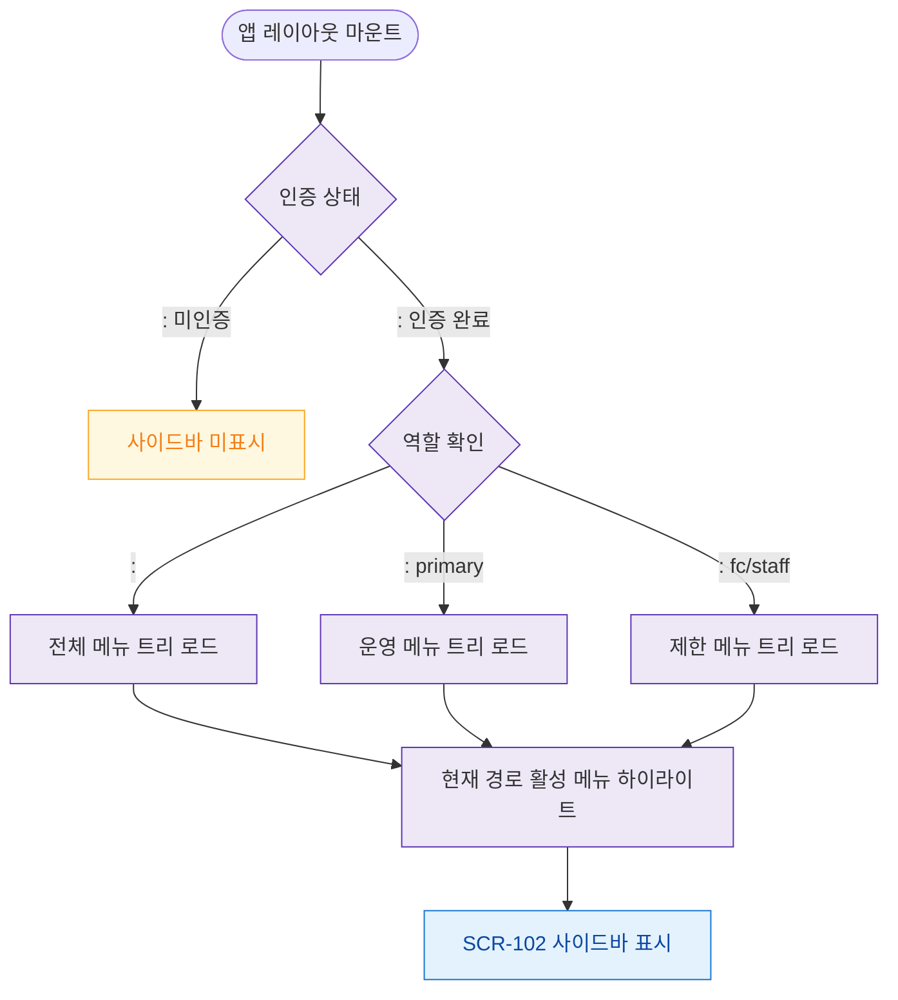

# F1 진입 플로우 — SCR-102 사이드바 네비게이션

## 목적
앱 레이아웃 마운트 시 사이드바 초기화 및 현재 경로 하이라이트 처리를 정의한다.

## 다이어그램

## TC 후보

| TC ID | 타입 | Given | When | Then |
|-------|------|-------|------|------|
| TC-102-F1-01 | positive | manager (로그인) | 앱 레이아웃 마운트 | 운영 메뉴 트리 표시 |
| TC-102-F1-02 | positive | | 앱 레이아웃 마운트 | 전체 메뉴 트리 표시 |
| TC-102-F1-03 | positive | staff | 앱 레이아웃 마운트 | 제한 메뉴 트리 표시 |
| TC-102-F1-04 | negative | (미인증) | 앱 진입 | 사이드바 미표시 |
