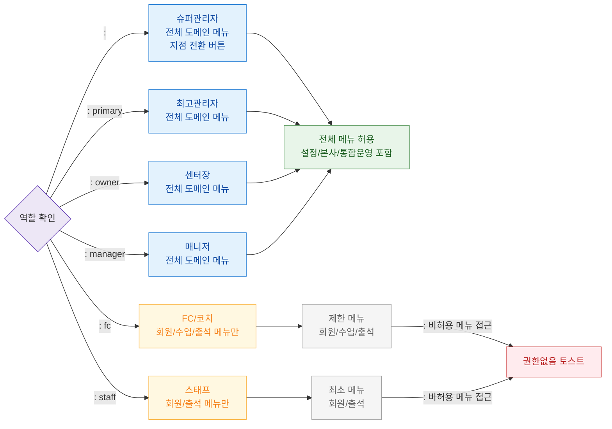

# F7 권한(RBAC) 분기 플로우 — SCR-102 사이드바 네비게이션

## 목적
6개 역할별 사이드바 메뉴 표시 범위를 정의한다.

## 다이어그램

## TC 후보

| TC ID | 타입 | Given | When | Then |
|-------|------|-------|------|------|
| TC-102-F7-01 | positive | | 사이드바 진입 | 전체 메뉴 + 지점 전환 버튼 표시 |
| TC-102-F7-02 | positive | manager | 사이드바 진입 | 전체 도메인 메뉴 표시 |
| TC-102-F7-03 | positive | staff | 사이드바 진입 | 회원/출석 메뉴만 표시 |
| TC-102-F7-04 | negative | fc | 설정 메뉴 직접 URL 접근 | 권한없음 토스트 |
