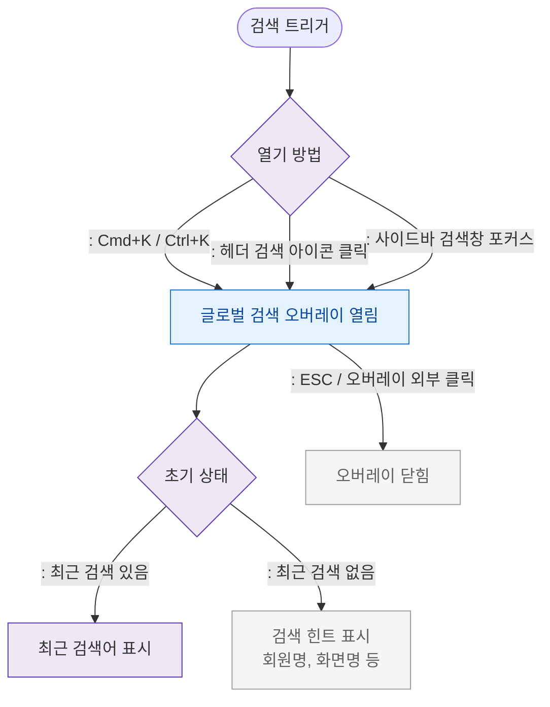

# F1 진입 플로우 — SCR-103 글로벌 검색

## 목적
글로벌 검색 오버레이 열기 경로(단축키/사이드바/헤더)와 초기 상태를 정의한다.

## 다이어그램

## TC 후보

| TC ID | 타입 | Given | When | Then |
|-------|------|-------|------|------|
| TC-103-F1-01 | positive | manager | Cmd+K 입력 | 글로벌 검색 오버레이 열림 |
| TC-103-F1-02 | positive | manager | 헤더 검색 아이콘 클릭 | 오버레이 열림 |
| TC-103-F1-03 | positive | manager (최근 검색 있음) | 오버레이 열림 | 최근 검색어 표시 |
| TC-103-F1-04 | positive | manager | ESC 입력 | 오버레이 닫힘 |
