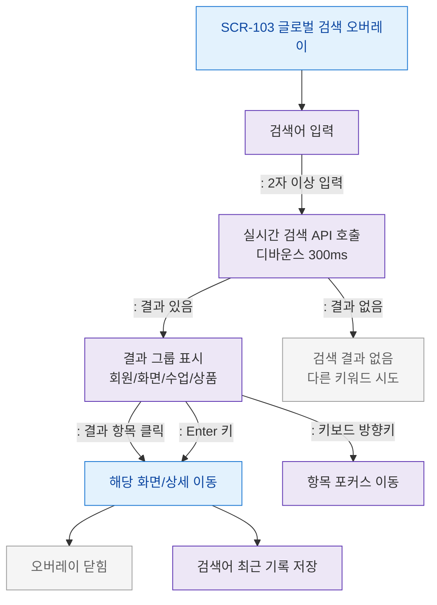

# F2 메인 인터랙션 플로우 — SCR-103 글로벌 검색

## 목적
키워드 입력 → 실시간 검색 → 결과 선택 → 화면 이동 흐름을 정의한다.

## 다이어그램

## TC 후보

| TC ID | 타입 | Given | When | Then |
|-------|------|-------|------|------|
| TC-103-F2-01 | positive | manager | 2자 이상 입력 | 실시간 검색 결과 표시 |
| TC-103-F2-02 | positive | manager | 결과 항목 클릭 | 해당 화면 이동 + 오버레이 닫힘 |
| TC-103-F2-03 | positive | manager | Enter 키 | 첫 번째 결과로 이동 |
| TC-103-F2-04 | negative | manager | 결과 없음 | 빈 상태 메시지 표시 |
| TC-103-F2-05 | positive | manager | 검색 후 이동 | 검색어 최근 기록 저장 |
