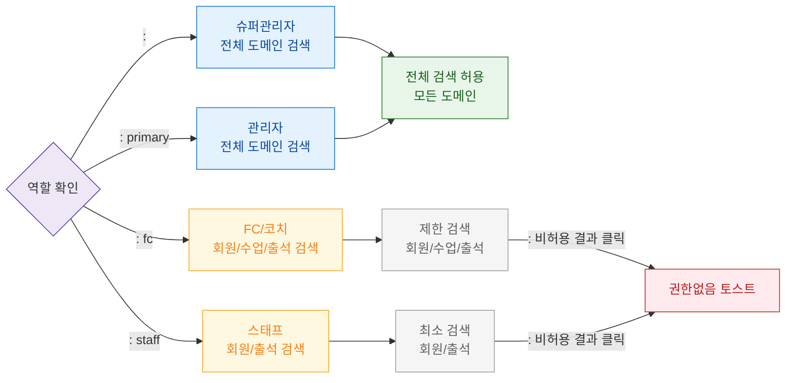

# F7 권한(RBAC) 분기 플로우 — SCR-103 글로벌 검색

## 목적
6개 역할별 검색 가능 도메인 범위를 정의한다.

## 다이어그램

## TC 후보

| TC ID | 타입 | Given | When | Then |
|-------|------|-------|------|------|
| TC-103-F7-01 | positive | manager | 검색 실행 | 전체 도메인 결과 표시 |
| TC-103-F7-02 | positive | staff | 검색 실행 | 회원/출석 결과만 표시 |
| TC-103-F7-03 | negative | fc | 비허용 도메인 결과 클릭 | 권한없음 토스트 |
