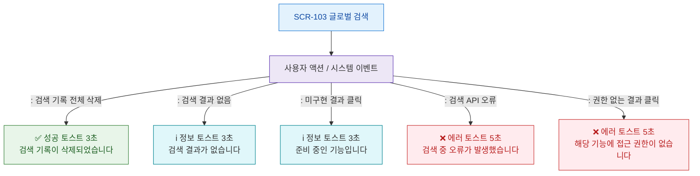

# F9 토스트/피드백 플로우 — SCR-103 글로벌 검색

## 목적
검색 관련 성공/경고/에러/정보 토스트 발생 조건과 메시지를 정의한다.

## 다이어그램

## TC 후보

| TC ID | 타입 | Given | When | Then |
|-------|------|-------|------|------|
| TC-103-F9-01 | positive | manager | 검색 기록 전체 삭제 | 성공 토스트 3초 표시 |
| TC-103-F9-02 | negative | manager | 검색 API 오류 | 에러 토스트 5초 표시 |
| TC-103-F9-03 | negative | fc | 비허용 결과 클릭 | 권한없음 에러 토스트 |
| TC-103-F9-04 | positive | manager | 결과 없음 | 정보 토스트 3초 표시 |
