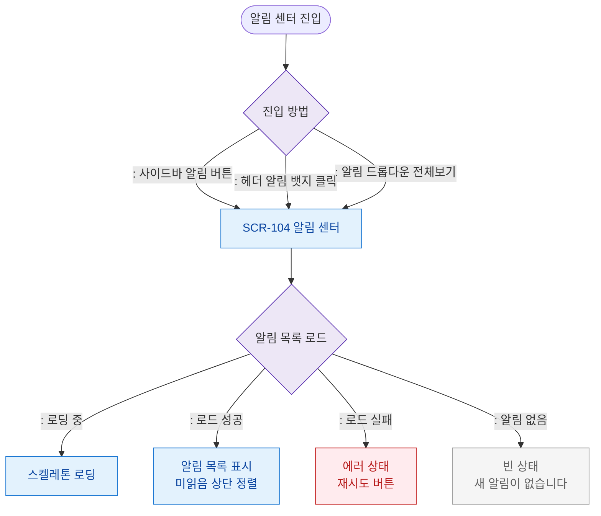

# F1 진입 플로우 — SCR-104 알림 센터

## 목적
알림 센터 진입 경로(사이드바/헤더 뱃지/드롭다운 전체보기)와 초기 로드 순서를 정의한다.

## 다이어그램

## TC 후보

| TC ID | 타입 | Given | When | Then |
|-------|------|-------|------|------|
| TC-104-F1-01 | positive | manager | 헤더 알림 뱃지 클릭 | 알림 센터 열림 |
| TC-104-F1-02 | positive | manager | 알림 센터 진입 | 미읽음 알림 상단 표시 |
| TC-104-F1-03 | negative | manager | 알림 없음 | 빈 상태 메시지 |
| TC-104-F1-04 | negative | manager | 로드 실패 | 에러 상태 + 재시도 |
