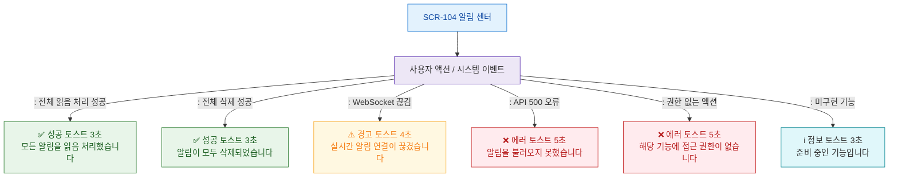

# F9 토스트/피드백 플로우 — SCR-104 알림 센터

## 목적
알림 센터 성공/경고/에러/정보 토스트 발생 조건과 메시지를 정의한다.

## 다이어그램

## TC 후보

| TC ID | 타입 | Given | When | Then |
|-------|------|-------|------|------|
| TC-104-F9-01 | positive | manager | 전체 읽음 성공 | 성공 토스트 3초 |
| TC-104-F9-02 | positive | manager | 전체 삭제 성공 | 성공 토스트 3초 |
| TC-104-F9-03 | negative | manager | WebSocket 끊김 | 경고 토스트 4초 |
| TC-104-F9-04 | negative | manager | API 500 오류 | 에러 토스트 5초 |
| TC-104-F9-05 | negative | fc | 전체 삭제 시도 | 권한없음 에러 토스트 |
