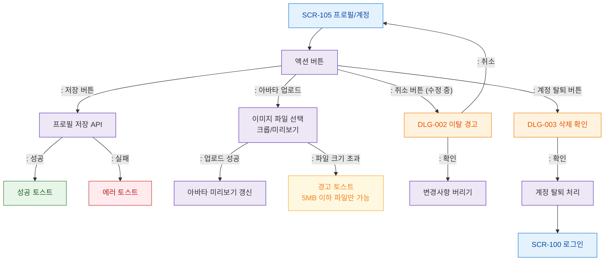

# F3 버튼/액션 플로우 — SCR-105 프로필/계정

## 목적
프로필 저장, 아바타 업로드, 이탈 경고, 계정 탈퇴 버튼 동작을 정의한다.

## 다이어그램

## TC 후보

| TC ID | 타입 | Given | When | Then |
|-------|------|-------|------|------|
| TC-105-F3-01 | positive | manager | 저장 버튼 클릭 | 프로필 저장 성공 토스트 |
| TC-105-F3-02 | positive | manager | 아바타 이미지 업로드 | 미리보기 갱신 |
| TC-105-F3-03 | negative | manager | 5MB 초과 파일 업로드 | 경고 토스트 |
| TC-105-F3-04 | positive | manager | 수정 중 취소 클릭 | DLG-002 이탈 경고 모달 |
| TC-105-F3-05 | negative | manager | 계정 탈퇴 확인 | 탈퇴 처리 후 로그인 이동 |
