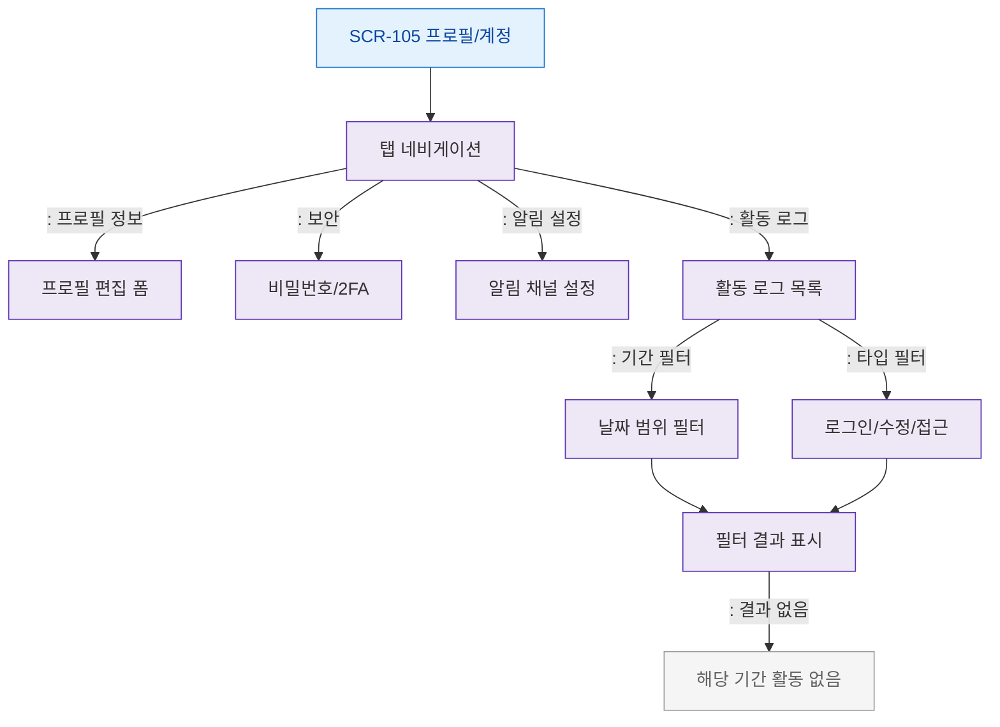

# F4 필터/검색 플로우 — SCR-105 프로필/계정

## 목적
프로필 탭 전환 및 활동 로그 필터 흐름을 정의한다.

## 다이어그램

## TC 후보

| TC ID | 타입 | Given | When | Then |
|-------|------|-------|------|------|
| TC-105-F4-01 | positive | manager | 보안 탭 클릭 | 비밀번호/2FA 폼 표시 |
| TC-105-F4-02 | positive | manager | 활동 로그 기간 필터 | 필터 결과 표시 |
| TC-105-F4-03 | negative | manager | 필터 결과 없음 | 빈 상태 메시지 |
