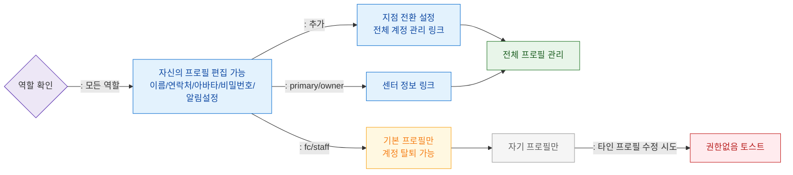

# F7 권한(RBAC) 분기 플로우 — SCR-105 프로필/계정

## 목적
6개 역할별 프로필/계정 편집 가능 범위를 정의한다.

## 다이어그램

## TC 후보

| TC ID | 타입 | Given | When | Then |
|-------|------|-------|------|------|
| TC-105-F7-01 | positive | manager | 프로필 진입 | 자신의 프로필 편집 폼 표시 |
| TC-105-F7-02 | positive | | 프로필 진입 | 지점 전환 설정 추가 표시 |
| TC-105-F7-03 | negative | staff | 타인 프로필 수정 시도 | 권한없음 토스트 |
