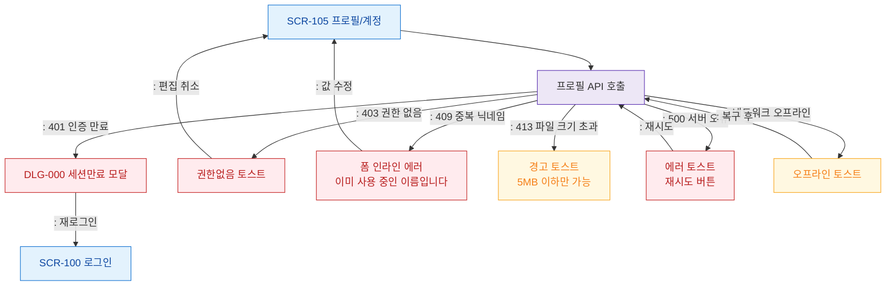

# F8 에러/예외/복구 플로우 — SCR-105 프로필/계정

## 목적
프로필 API 오류 분기와 복구 경로를 정의한다.

## 다이어그램

## TC 후보

| TC ID | 타입 | Given | When | Then |
|-------|------|-------|------|------|
| TC-105-F8-01 | negative | manager | 세션 만료 상태 | DLG-000 세션만료 모달 |
| TC-105-F8-02 | negative | manager | 중복 닉네임 저장 | 인라인 에러 메시지 |
| TC-105-F8-03 | negative | manager | 5MB 초과 파일 업로드 | 경고 토스트 |
| TC-105-F8-04 | negative | manager | 저장 API 500 오류 | 에러 토스트 + 재시도 |
