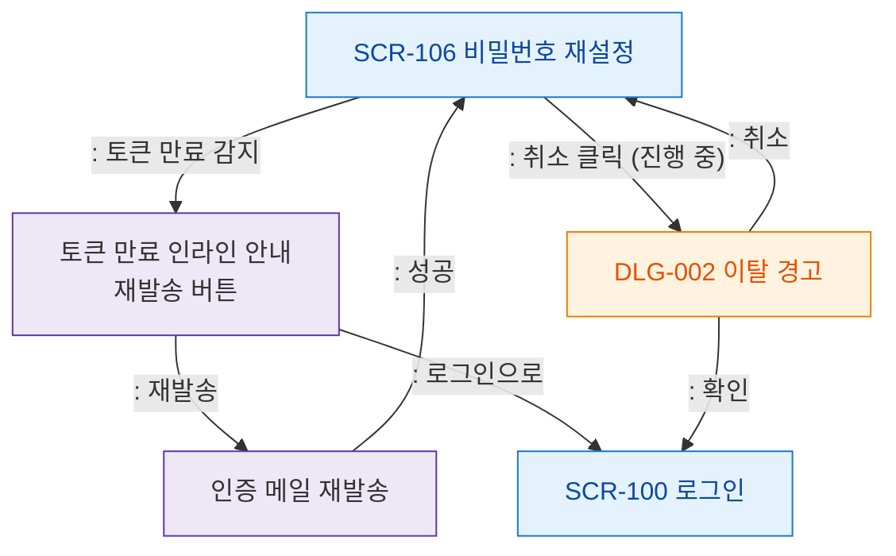

# F5 모달 트리거 트리 — SCR-106 비밀번호 재설정

## 목적
비밀번호 재설정 화면에서 발생하는 모달/다이얼로그 트리거 경로를 정의한다.

## 다이어그램

## TC 후보

| TC ID | 타입 | Given | When | Then |
|-------|------|-------|------|------|
| TC-106-F5-01 | negative | (비로그인) | 토큰 만료 링크 접근 | 토큰 만료 안내 + 재발송 버튼 |
| TC-106-F5-02 | positive | (비로그인) | 진행 중 취소 클릭 | DLG-002 이탈 경고 열림 |
| TC-106-F5-03 | positive | (비로그인) | 재발송 성공 | 메일 발송 완료 안내 |
