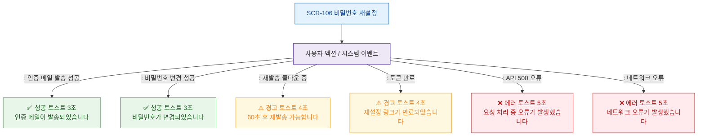

# F9 토스트/피드백 플로우 — SCR-106 비밀번호 재설정

## 목적
비밀번호 재설정 성공/경고/에러/정보 토스트 발생 조건과 메시지를 정의한다.

## 다이어그램

## TC 후보

| TC ID | 타입 | Given | When | Then |
|-------|------|-------|------|------|
| TC-106-F9-01 | positive | (비로그인) | 메일 발송 성공 | 성공 토스트 3초 |
| TC-106-F9-02 | positive | (비로그인) | 비밀번호 변경 성공 | 성공 토스트 3초 |
| TC-106-F9-03 | negative | (비로그인) | 60초 내 재발송 | 경고 토스트 4초 |
| TC-106-F9-04 | negative | (비로그인) | API 500 오류 | 에러 토스트 5초 |
