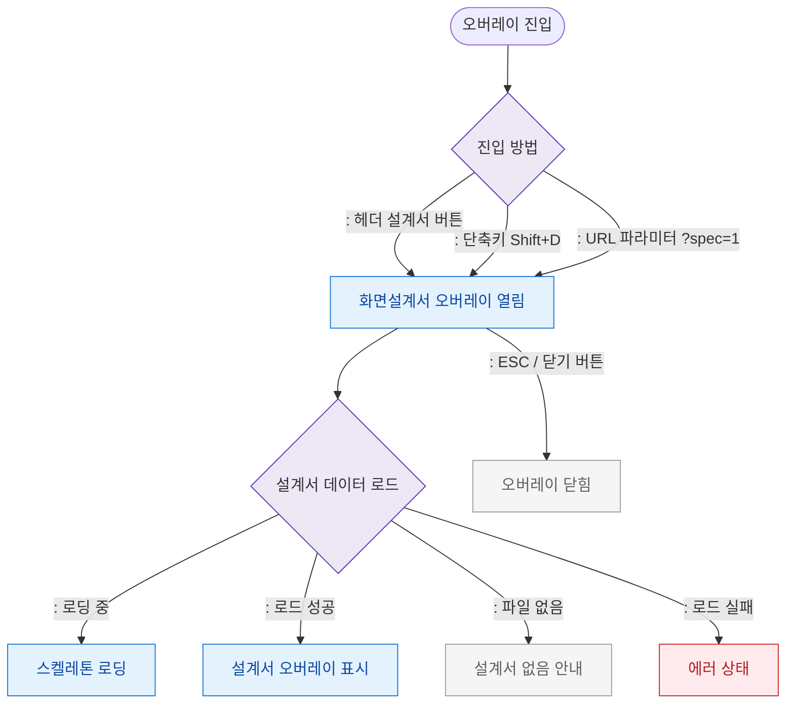

# F1 진입 플로우 — SCR-107 화면설계서 오버레이

## 목적
화면설계서 오버레이 진입 경로(단축키/헤더 버튼)와 초기 로드를 정의한다.

## 다이어그램

## TC 후보

| TC ID | 타입 | Given | When | Then |
|-------|------|-------|------|------|
| TC-107-F1-01 | positive | manager | 헤더 설계서 버튼 클릭 | 오버레이 열림 |
| TC-107-F1-02 | positive | manager | Shift+D 단축키 | 오버레이 열림 |
| TC-107-F1-03 | positive | manager | 설계서 로드 성공 | 오버레이 표시 |
| TC-107-F1-04 | negative | manager | 설계서 파일 없음 | 안내 메시지 표시 |
