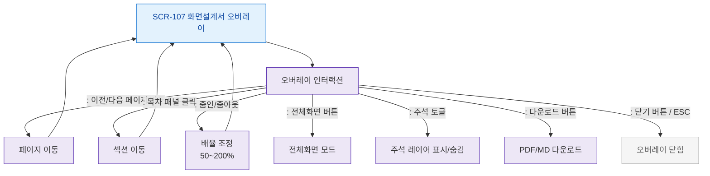

# F2 메인 인터랙션 플로우 — SCR-107 화면설계서 오버레이

## 목적
설계서 문서 탐색, 페이지 이동, 줌/패닝, 주석 보기 인터랙션을 정의한다.

## 다이어그램

## TC 후보

| TC ID | 타입 | Given | When | Then |
|-------|------|-------|------|------|
| TC-107-F2-01 | positive | manager | 다음 페이지 버튼 | 다음 페이지로 이동 |
| TC-107-F2-02 | positive | manager | 목차 항목 클릭 | 해당 섹션으로 이동 |
| TC-107-F2-03 | positive | manager | 줌인 버튼 | 배율 증가 |
| TC-107-F2-04 | positive | manager | 주석 토글 | 주석 레이어 표시/숨김 |
