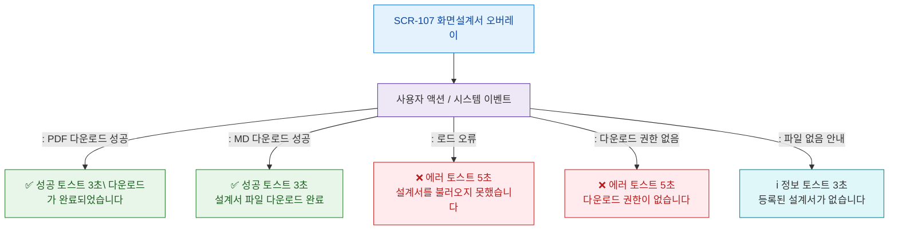

# F9 토스트/피드백 플로우 — SCR-107 화면설계서 오버레이

## 목적
오버레이 성공/경고/에러/정보 토스트 발생 조건과 메시지를 정의한다.

## 다이어그램

## TC 후보

| TC ID | 타입 | Given | When | Then |
|-------|------|-------|------|------|
| TC-107-F9-01 | positive | manager | PDF 다운로드 성공 | 성공 토스트 3초 |
| TC-107-F9-02 | negative | manager | 로드 오류 | 에러 토스트 5초 |
| TC-107-F9-03 | negative | fc | 다운로드 시도 | 권한없음 에러 토스트 |
