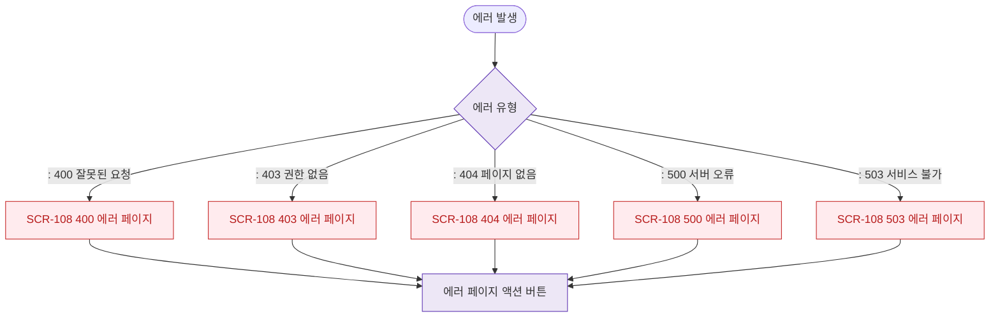

# F1 진입 플로우 — SCR-108 에러 페이지

## 목적
에러 페이지(400/403/404/500/503) 진입 경로를 정의한다.

## 다이어그램

## TC 후보

| TC ID | 타입 | Given | When | Then |
|-------|------|-------|------|------|
| TC-108-F1-01 | negative | manager | 403 에러 발생 | 403 에러 페이지 표시 |
| TC-108-F1-02 | negative | manager | 404 에러 발생 | 404 에러 페이지 표시 |
| TC-108-F1-03 | negative | manager | 500 에러 발생 | 500 에러 페이지 표시 |
