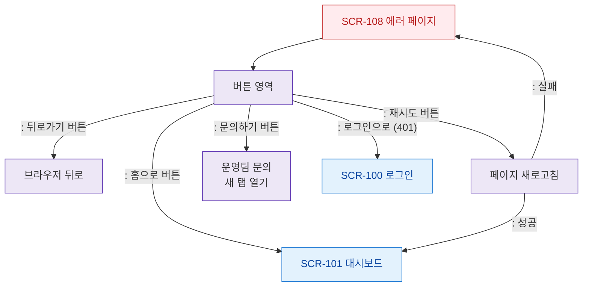

# F3 버튼/액션 플로우 — SCR-108 에러 페이지

## 목적
에러 페이지 버튼(홈/뒤로/재시도/문의) 동작을 정의한다.

## 다이어그램

## TC 후보

| TC ID | 타입 | Given | When | Then |
|-------|------|-------|------|------|
| TC-108-F3-01 | positive | manager | 홈으로 버튼 | 대시보드 이동 |
| TC-108-F3-02 | positive | manager | 재시도 성공 | 대시보드 이동 |
| TC-108-F3-03 | negative | manager | 재시도 실패 | 에러 페이지 유지 |
