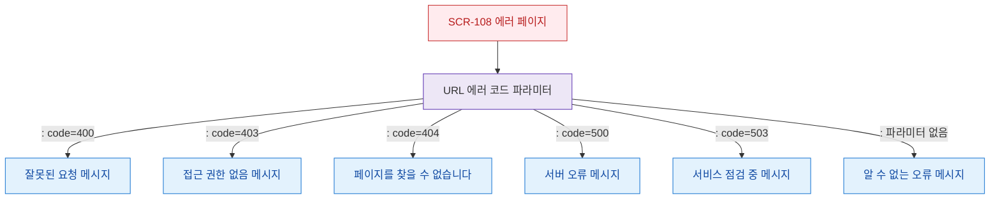

# F4 필터/검색 플로우 — SCR-108 에러 페이지

## 목적
에러 페이지에서 에러 코드별 안내 메시지 분기를 정의한다. 검색/필터 기능은 없으나 에러 코드 파라미터 처리를 포함한다.

## 다이어그램

## TC 후보

| TC ID | 타입 | Given | When | Then |
|-------|------|-------|------|------|
| TC-108-F4-01 | positive | manager | code=403 파라미터 | 접근 권한 없음 메시지 표시 |
| TC-108-F4-02 | positive | manager | code=404 파라미터 | 페이지 없음 메시지 표시 |
| TC-108-F4-03 | positive | manager | 파라미터 없음 | 기본 오류 메시지 표시 |
