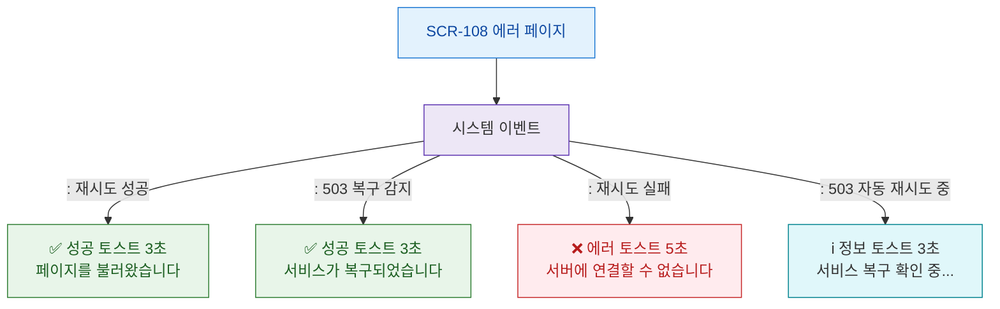

# F9 토스트/피드백 플로우 — SCR-108 에러 페이지

## 목적
에러 페이지 관련 토스트 발생 조건과 메시지를 정의한다. 에러 페이지 자체가 전체 화면 에러이므로 토스트는 최소화된다.

## 다이어그램

## TC 후보

| TC ID | 타입 | Given | When | Then |
|-------|------|-------|------|------|
| TC-108-F9-01 | positive | manager | 재시도 성공 | 성공 토스트 3초 |
| TC-108-F9-02 | negative | manager | 재시도 실패 | 에러 토스트 5초 |
| TC-108-F9-03 | positive | manager | 503 복구 감지 | 복구 성공 토스트 |
