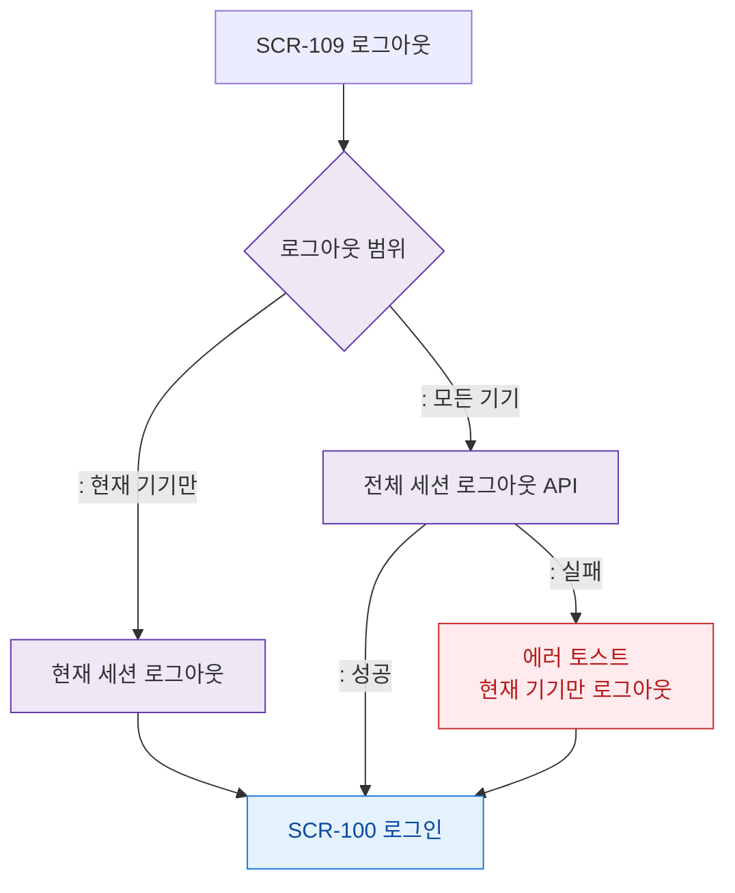

# F4 필터/검색 플로우 — SCR-109 로그아웃

## 목적
로그아웃은 단일 액션으로 필터/검색 기능이 없다. 다중 기기 세션 선택적 로그아웃 흐름을 정의한다.

## 다이어그램

## TC 후보

| TC ID | 타입 | Given | When | Then |
|-------|------|-------|------|------|
| TC-109-F4-01 | positive | manager | 현재 기기 로그아웃 | 현재 세션 종료 + SCR-100 |
| TC-109-F4-02 | positive | manager | 전체 기기 로그아웃 | 모든 세션 종료 + SCR-100 |
| TC-109-F4-03 | negative | manager | 전체 로그아웃 API 실패 | 현재 기기만 로그아웃 |
