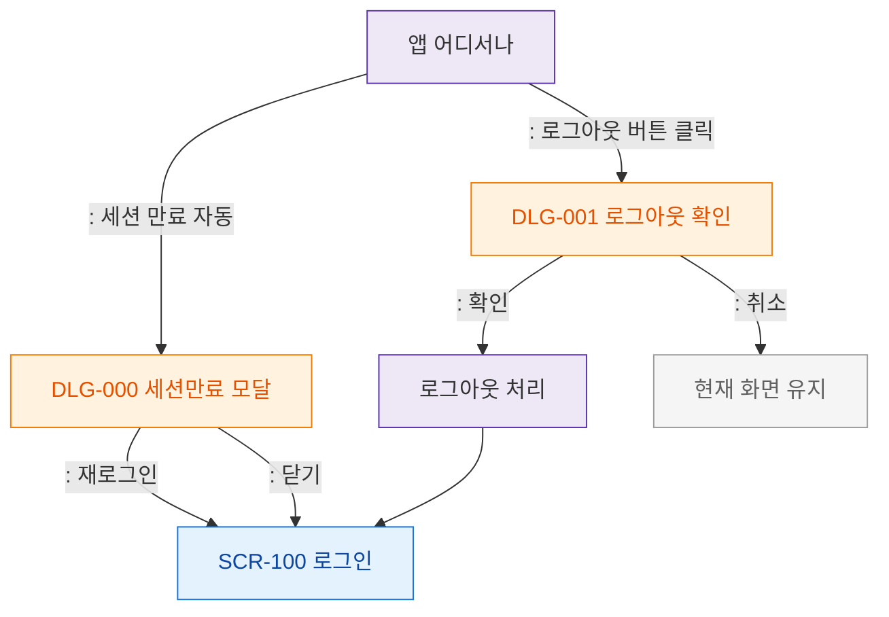

# F5 모달 트리거 트리 — SCR-109 로그아웃

## 목적
로그아웃 흐름에서 발생하는 모달 트리거 경로를 정의한다.

## 다이어그램

## TC 후보

| TC ID | 타입 | Given | When | Then |
|-------|------|-------|------|------|
| TC-109-F5-01 | positive | manager | 로그아웃 버튼 | DLG-001 열림 |
| TC-109-F5-02 | negative | manager | 세션 만료 자동 | DLG-000 세션만료 모달 |
| TC-109-F5-03 | positive | manager | DLG-001 확인 | 로그아웃 처리 + SCR-100 |
