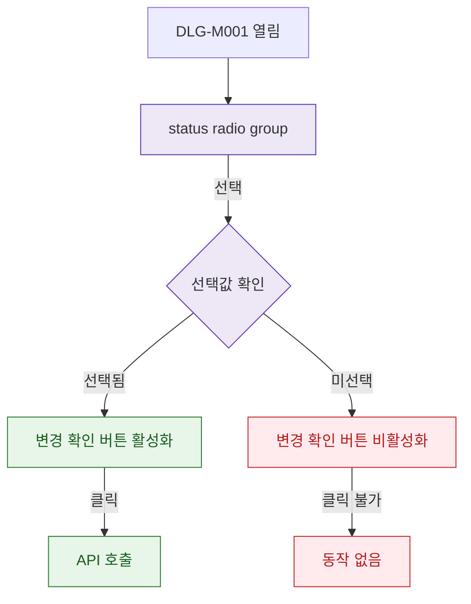

## 1. 목적

DLG-M001의 필드 유효성 검증 흐름을 명세한다.

## 2. 트리거/전제조건

- DLG-M001 열린 상태

## 3. 다이어그램

## 4. 엣지 설명

| 출발 | 도착 | 조건 |
|------|------|------|
| radio group | 선택값 확인 | 사용자 선택 |
| 선택값 확인 | 버튼 활성화 | 선택됨 |
| 선택값 확인 | 버튼 비활성 | 미선택 |
| 버튼 활성 | API 호출 | 클릭 |
