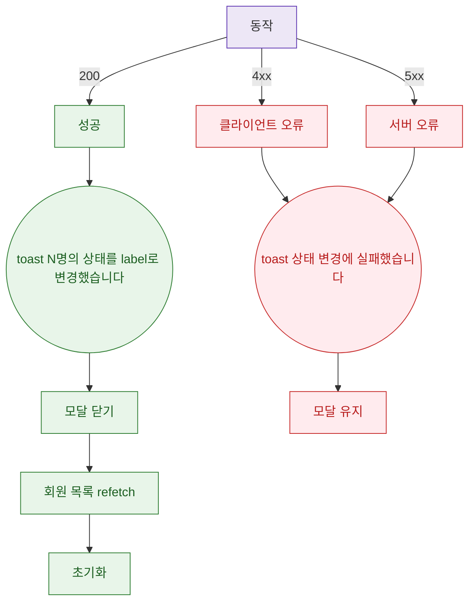

## 1. 목적

DLG-M001 API 응답별 결과 분기와 후속 동작을 명세한다.

## 2. 트리거/전제조건

- 호출 후

## 3. 다이어그램

## 4. 엣지 설명

| 출발 | 도착 | 조건 |
|------|------|------|
| API | 성공 | 200 |
| API | 클라이언트 오류 | 4xx |
| API | 서버 오류 | 5xx |
| 성공 | toast | - |
| toast | 모달 닫기 | - |
| 모달 닫기 | 목록 갱신 | - |
