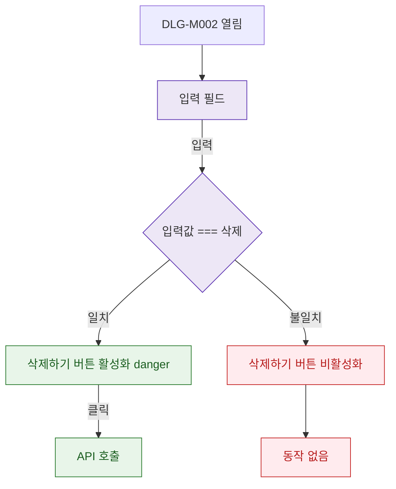

## 1. 목적

DLG-M002의 확인 텍스트 입력 검증 흐름을 명세한다.

## 2. 트리거/전제조건

- DLG-M002 열린 상태

## 3. 다이어그램

## 4. 엣지 설명

| 출발 | 도착 | 조건 |
|------|------|------|
| 입력 필드 | 검증 | 입력 이벤트 |
| 검증 | 버튼 활성 | "삭제" 일치 |
| 검증 | 버튼 비활성 | 불일치 |
| 버튼 활성 | API | 클릭 |
