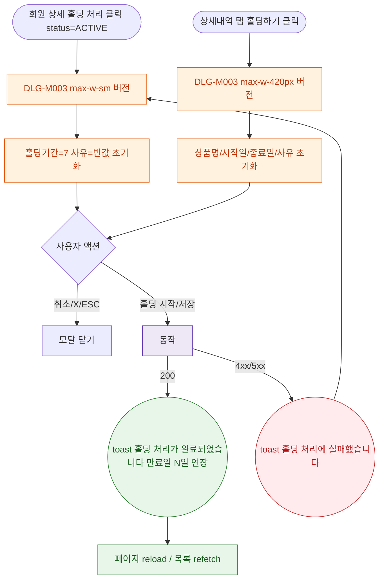

## 1. 목적

DLG-M003 홀딩 등록 다이얼로그의 열기/닫기/완료 생명주기를 명세한다.

## 2. 트리거/전제조건

- 회원 상세 > 상태 관리 > "홀딩 처리" (status==='ACTIVE')
- 또는 상세내역 탭 > 홀딩 서브탭 > "홀딩하기"

## 3. 다이어그램

## 4. 엣지 설명

| 출발 | 도착 | 조건 |
|------|------|------|
| 홀딩 처리 버튼 | 모달(상세) | status=ACTIVE |
| 홀딩하기 버튼 | 모달(탭) | - |
| 홀딩 시작 | API | 필수 충족 |
| API | toast | 200 |
| API | toast | 오류 |
